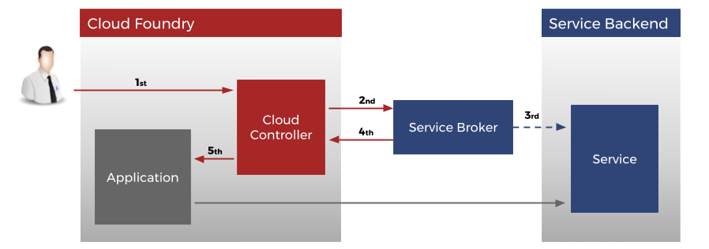
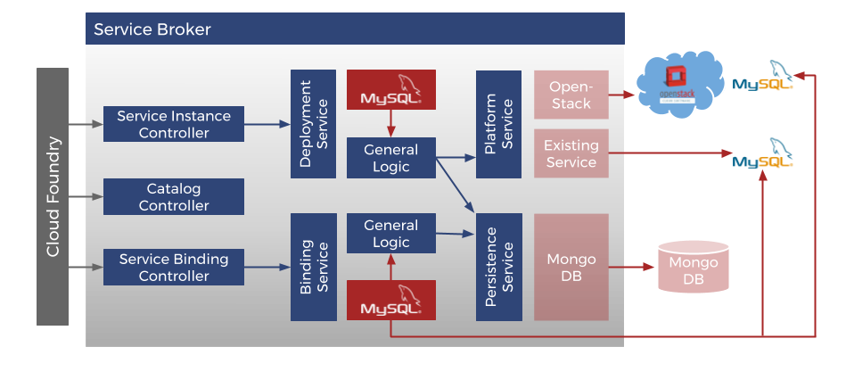

#Table of Contents

1. [Open Service Broker Framework (by evoila)](#open-service-broker-framework-by-evoila)
    * 1.1 [What does that mean in detail?](#what-does-that-mean-in-detail)
    * 1.2 [Terminology of the evoila OSB-Framework](#terminology-of-the-evoila-osb-framework)
      * 1.2.1 [Shared Clusters (Existing Service)](#shared-clusters-existing-service)
      * 1.2.2 [Dedicated VMs/Clusters](#dedicated-vms-and-clusters)
      * 1.2.3 [Site](#site)
2. [Components](pages/components.md)
3. [Configuring a Service Broker](pages/configure-service-broker.md)
4. [Service Keys](pages/service-keys.md)
5. [Backup Agent](pages/backup-agent.md)
6. [Development](pages/development.md)
7. [IDE & Runtime](pages/ide-runtime.md)
8. [Contribution](pages/contribution.md)
9. [License](pages/license.md)
---

# Open Service Broker Framework (by evoila)

A Service Broker provides the possibility to extend a platform [Cloud Foundry](https://www.cloudfoundry.org/) and [Kubernetes](https://www.https://kubernetes.io//) with services (for example a database) that can be consumed by applications deployed to this platform.

## What does that mean in detail?
When deploying applications to Container as a Service (CaaS) or Platform as a Service (PaaS), applications need to consume backend services like databases, queueing engines.  
  
To standardize the consumption and usage of backend service the [OSB-API](https://github.com/openservicebrokerapi/servicebroker/) spec define a set of operations,which are describe by the following terms:
* Catalog
    * Services 
    * Plans
* Service Instances (a database in a Cluster/a complete dedicated database cluster)
* Service Bindings (credentials username/password, ceritificates dynamically created and provided for specific application)

For a better understanding of Cloud Foundry Service Brokers also visit [https://docs.cloudfoundry.org/services/api.html](https://docs.cloudfoundry.org/services/api.html).

# Terminology of the evoila OSB-Framework

## Shared Clusters (Existing Service)
Shared Clusters host Service Instances of several users with a multitenancy separation. E.g. a large PostgreSQL Cluster, which allows customers/developers to provision a database instance. 

Instances on shared clusters are particularly inexpensive, but have limitations in their performance and parameterization possibilities. The services should be hardened so that users can never access external data. Shared Cluster and Service Instances on it should NEVER BE USED FOR PRODUCTION. Most databases do not provide out-of-the-box features for noisy neighbours, connection and resource limitation on a granular level.

As you can't scale clusters indefinitely or you want to provide different service classes of your existing clusters (Silver, Gold, Platinum based on Storage Performance), the OSB Framework provides the ability to configure an unlimited number of so called `existing endpoints`. 

For more information see the documentation regarding our declarative approach of Plans. 

## Dedicated VMs and Clusters
Dedicated VMs/Containers and Clusters are Service Instances that are provisioned as needed. Usually the customer is granted more rights on these Service Instances, e.g. to create more databases or users. In addition, more parameters of the service can be set to adapt performance to his use case.  

## Site
A Site is a dedicated Cloud Foundry/Kubernetes deployment. The Open Service Broker Framework currently supports an unlimited number of parallel sites.

---

    
<a href="pages/components.md">Next -></a>

