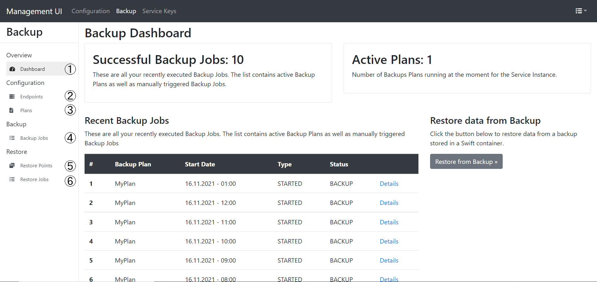
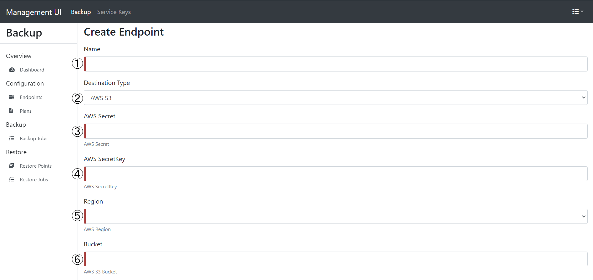
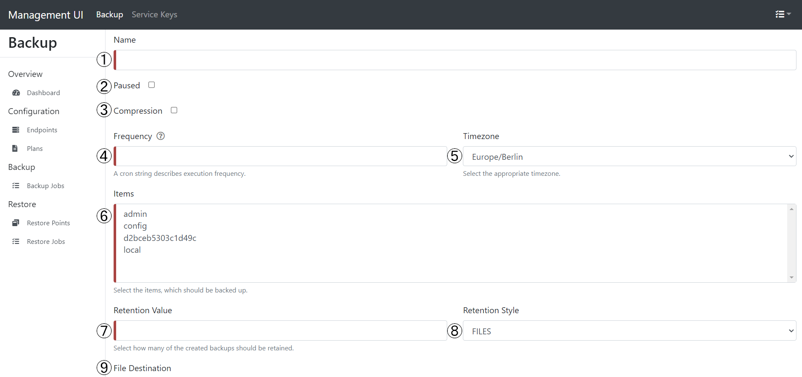

# Broker Management UI

- [Broker Management UI](#broker-management-ui)
  - [Overview](#overview)
  - [Configuration](#configuration)
  - [Backup Dashboard](#backup-dashboard)
  - [Creating a Backup Endpoint](#creating-a-backup-endpoint)
  - [Creating a Backup Plan](#creating-a-backup-plan)
  - [FAQ](#faq)
    - [No items visible in Backup Plan](#no-items-visible-in-backup-plan)

---

## Overview

The Management UI offers an overview of the service instance provided by the OSB and allows to set up backup plans, restore from backups and to create service keys.

## Configuration

Configuration is not fully implemented yet and therefore not supported.

## Backup Dashboard

The backup dashboard can be accessed by clicking on **Backup** on the top of the UI.

The following image shows the backup dashboard:

1. Opens the Backup Dashboard main page (as seen on screenshot).
2. Shows the list of endpoints for backups. New endpoints can also be created here.
3. Shows the list of backups plans. New plans can also be created here.
4. Shows the history of executed backup jobs.
5. Shows the list of available restore points that have been created by the backup jobs.
6. Shows the history of executed restore jobs.

## Creating a Backup Endpoint

Backup endpoints can be set up here. These are the endpoints where the backups will be stored.

First, click on **Endpoints** (found on the left side in Backup->Configuration->Endpoints). Here, you can find the endpoints that are currently available. Now, click on **Create File Endpoint**.

The following form will be shown:

1. The name of the endpoint, can be chosen freely.
2. Here, you can select the storage (for example, AWS S3 or Custom S3).*
3. S3 Secret From admin (or generated by User).
4. S3 SecretKey From admin (or generated by User).
5. Region of S3 server.
6. Bucket Name.

\*If **Custom S3** is chosen as destination, addtionally an Endpoint has to be provided.

After filling out click on **Validate** on the bottom of the form. If the values are valid, you then can submit them by clicking on the **Submit** button, that has appeared.

## Creating a Backup Plan

First, click on **Plans** (found on the left side in Backup->Configuration->Endoints). This will show an overview of the active backup plans. Now, click on **Create Backup Plan**.

The following form will be shown:

1. The name of the backup plan, can be chosen freely.
2. If checked, the backup plan will be paused after being created.
3. If checked, the backup will be compressed.
4. The frequecy how often the backup job should be executed. A Cronjob in Spring-format has to be provided (not Linux).
5. Select the timezone for the cronjob.
6. Select the items that must be backed up.
7. Amount of backups that should be stored (e.g. if the value is **1** the last backup will be deleted if a new backup is made)
8. The retention style **Files** limits the amount of backups to a certain quantity.
9. Select Endpoint where backup will be stored.

After filling out the form, click on **Submit**.

## FAQ

### No items visible in Backup Plan
Please contact the administrator to check if you have to correct role assigned (you need have the developer role).