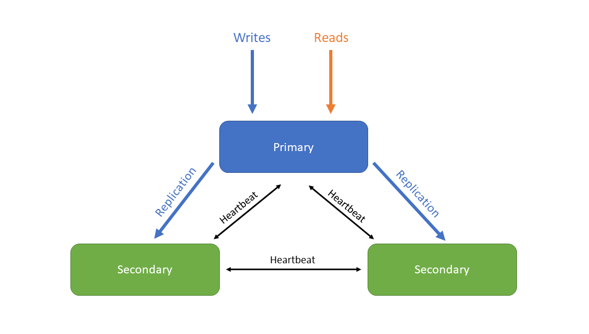

# OSB-MongoDB
- [OSB-MongoDB](#osb-mongodb)
  - [Overview](#overview)
    - [Key Features](#key-features)
    - [Software used by OSB-MongoDB](#software-used-by-osb-mongodb)
    - [Cluster](#cluster)
  - [Requirements](#requirements)
  - [How to](#how-to)
    - [Create a Service Instance](#create-a-service-instance)
    - [Update a Service Instance](#update-a-service-instance)
    - [Create a Service Binding](#create-a-service-binding)
    - [Acquiring Service Instance Parameters](#acquiring-service-instance-parameters)
    - [Backup](#backup)
  - [FAQ](#faq)
    - [OSB-MongoDB crashed](#osb-mongodb-crashed)
    - [A MongoDB instance crashed](#a-mongodb-instance-crashed)
    - [The size of the backup was bigger than expected (and failed) and now all of my storage space is occupied](#the-size-of-the-backup-was-bigger-than-expected-and-failed-and-now-all-of-my-storage-space-is-occupied)

---

## Overview

[MongoDB](https://www.mongodb.com/) is a source-available, cross-platform document database that uses JSON-like documents with optional schemas and is designed for ease of development and scaling.  It was first released in 2009 and is continuously developed since then and is the most common NoSQL database.

### Key Features

- **High Performance**: MongoDB provides a high performance data persistence by supporting embedded data models and indexes for faster queries.
- **Rich Query Language**: MongoDB supports [CRUD-operations](https://docs.mongodb.com/manual/crud/) as well as data aggregation and text search.
- **High Availability**: MongoDB has an integrated replication facility, called [replica set](https://docs.mongodb.com/manual/replication/), which provides automatic failover and data redundancy.
- **Horizontal Scalability**: Horizonal scalability is a core function of MongoDB. This is realized by using [sharding](https://docs.mongodb.com/manual/sharding/), which distributes data across a cluster of machines. This feature is not supported by the OSB-MongoDB.
- **Multiple Storage Engines**: MongoDB supports [multiple storage engines](https://docs.mongodb.com/manual/core/storage-engines/).

For more information, see [MongoDB Manual](https://docs.mongodb.com/manual/).

This project is part of our service broker project. For documentation of the service broker see [evoila/osb-docs](https://github.com/evoila/osb-docs).
The OSB-MongoDB offers different service plans which vary in allocated memory, cpu, disc-size and number of vms created for MongoDB.

### Software used by OSB-MongoDB
- **MongoDB**: 4.4.4, 4.4.10, 5.0.4

### Cluster

As mentioned in the [overview](#overview), MongoDB uses a replica set to provide automatic failover and data redundancy.
Instances of MongoDB cluster consist of a so-called [**primary**](https://docs.mongodb.com/manual/core/replica-set-primary/) which accepts read and (by default) write operations and [**secondaries**](https://docs.mongodb.com/manual/core/replica-set-secondary/) in which the oplog is saved, which is a log of all operations that modify the data stored in the database. The operations of the oplog are applied to the secondaries in a asynchronous process.
The different nodes check each others status by sending and receiving a heartbeat (ping). If the primary is not available for (by default) more than 10 seconds, an eligible secondary will hold an election to elect itself the new primary.

The following image show the interaction between the nodes:


## Requirements
- [Cloud Foundry CLI](https://docs.cloudfoundry.org/cf-cli/install-go-cli.html)

## How to
### Create a Service Instance

A service instance can be created manually via the CLI-Command
```
cf create-service SERVICE PLAN SERVICE_INSTANCE [-b BROKER] [-c PARAMETERS_AS_JSON] [-t TAGS]
```

- **SERVICE** will be the name of the service broker which is likely going to be **osb-mongodb**
- **PLAN** is a plan offered by the service.
- **SERVICE_INSTANCE** the name of the service instance, can be chosen freely.
- **PARAMETERS_AS_JSON** contains additional parameters in JSON-format.

For more information see [Cloud Foundry CLI Reference Guide](https://cli.cloudfoundry.org/en-US/v6/create-service.html)

Aternatively, if there is a dashboard set up (like the Stratos Dashboard for example), it can be used to create a service instance.

### Update a Service Instance

A service instance can be updated manually via the CLI-Command
```
cf update-service SERVICE_INSTANCE [-p NEW_PLAN] [-c PARAMETERS_AS_JSON] [-t TAGS] [--upgrade]
```

- **SERVICE_INSTANCE** is be the name of the previously created service instance.
- **PARAMETERS_AS_JSON** contains additional parameters in JSON-format.

For more information see [Cloud Foundry CLI Reference Guide](https://cli.cloudfoundry.org/en-US/v6/update-service.html)


Aternatively, if there is a dashboard set up (like the Stratos Dashboard for example), it can be used to update a service instance.

Keep in mind that **previous values will be overwritten**. In order to see the existing parameters you can use a dashboard or acquire the parameters via cli (see [Acquiring Service Instance Parameters](#acquiring-service-instance-parameters)).

### Create a Service Binding

A binding can be created manually via the CLI-Command 
```
cf bind-service APP_NAME SERVICE_INSTANCE [-c PARAMETERS_AS_JSON] [--binding-name BINDING_NAME]
```

- **APP_NAME** ist the name of the previously created app that gets the binding injected.
- **SERVICE_INSTANCE** is be the name of the previously created service instance.
- **PARAMETERS_AS_JSON** contains additional parameters in JSON-format.


For more information see [Cloud Foundry CLI Reference Guide](https://cli.cloudfoundry.org/en-US/v6/bind-service.html).
After creating a binding, the app has to be restarted for the changes to take effect.

Aternatively, if there is a dashboard set up (like the Stratos Dashboard for example), it can be used to create a service binding.

### Acquiring Service Instance Parameters

The current parameters of a service instance can be retrieved via cli:

1. ```cf service --guid **SERVICE_INSTANCE**```
2. ```cf curl v3/service_instances/**SERVICE_INSTANCE_ID**/parameters```
3. A JSON with the parameters will be returned.

- **SERVICE_INSTANCE** is be the name of the previously created service instance.
- **SERVICE_INSTANCE_ID** is the guid of the service instance which is acquired in step 1. 


### Backup

It is important to keep in mind that there is enough space for the database and backup. Since the MongoDB backup uses gzip, the expected size of the backup is about 20% of the database (the backup can be even smaller but a reduction to at least 20% can be expected). The current size of the database can be seen by accessing the MongoDB instance via SSH (this can be done with the [Bosh CLI](https://bosh.io/docs/cli-v2/)) and executing the command `db.stats()` (the value of the field **dataSize**) or alternatively `db.stats().dataSize`.
> **_IMPORTANT:_** Changes to the database while creating a backup may not be recorded and therefore not be included in the backup.

The size of a plan can be scaled up afterwards but this will copy the disk.

Setting up a backup can be done the dashboard-url of the service instance (which can be retrieved by the cli command **cf service SERVICE_INSTANCE**). For more information, see the Backup Docs.

## FAQ

### OSB-MongoDB crashed

If the service broker crashes, the operator should be contacted.

### A MongoDB instance crashed

As long as the majority of MongoDB instances is running after another instance failed, the database is still functional. The Bosh director will detect the failure and try to repair the broken instance. If an automatic repair of the instance is not possible, it has to be fixed manually.

The following causes can lead to a failure:
- IaaS problems with VMs, network or storage.
- Storage space completely occupied.

Access to the VM via [Bosh CLI](https://bosh.io/docs/cli-v2/) is required for debugging. First, the following two files have to be sourced within the VM.

```
/var/vcap/jobs/mongodb/env
/var/vcap/jobs/mongodb/bin/post-deploy
```
Start the Mongo cli ($MONGO) as admin (password can be found in **post-deploy** or CredHub for example) --authenticationDatabase admin --host $MONGODB_HOST.

For example:
```
$MONGO -u admin -p ADMIN_PASSWORD --authenticationDatabase admin --host $MONGODB_HOST
```
Afterwards the state of the cluster can be retrieved with the command `rs.status()`. 
Additional information can be retrieved with the command `rs.isMaster()`.

**Majority** of nodes (including primary) failed and can't be reinitialized:</br>
In this case no secondary can be elected as primary. The only options are reinitializing the replica set or [reconfiguring](https://docs.mongodb.com/manual/tutorial/reconfigure-replica-set-with-unavailable-members/) it.

In many cases it is also possible, to retrieve the oplog of a failed primary with [`mongodump`](https://docs.mongodb.com/database-tools/mongodump/) using the `--oplog` flag and recover the database by replaying the oplog with [`mongorestore`](https://docs.mongodb.com/database-tools/mongorestore/) using the `--oplogReplay` flag.
Currently, replaying an oplog is not supported by the Backup Manager. Changes to the database while doing a backup **may not** be recorded.

The following logs are relevant for troubleshooting:

```
/var/vcap/sys/log/mongodb/server.stderr.log
/var/vcap/sys/log/mongodb/server.stdout.log
```

While performing maintenance on single replica set members, each node has to be restarted as standalone. Afterwards, maintenance can be done on the node and then be restarted as a member of the replica set. The primary should come last. More information about maintaining replica set members can be found [here](https://docs.mongodb.com/manual/tutorial/perform-maintence-on-replica-set-members/).

If the error **cannot be fixed**, a new instance has to be created and restored by using a backup.

### The size of the backup was bigger than expected (and failed) and now all of my storage space is occupied

In this case, contact the operator.
