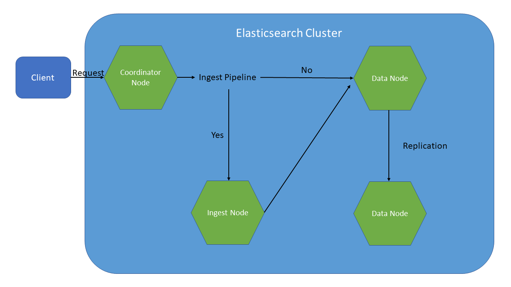

# OSB-Elasticsearch
- [OSB-Elasticsearch](#osb-elasticsearch)
    - [Overview](#overview)
        - [Key Features](#key-features)
        - [Software used by OSB-Elasticsearch](#software-used-by-osb-elasticsearch)
        - [Cluster](#cluster)
    - [Requirements](#requirements)
    - [How to](#how-to)
        - [Create a Service Instance](#create-a-service-instance)
        - [Update a Service Instance](#update-a-service-instance)
        - [Create a Service Binding](#create-a-service-binding)
        - [Acquiring Service Instance Parameters](#acquiring-service-instance-parameters)
        - [Backup](#backup)
        - [Change SSL Certificates](#change-ssl-certificates)
    - [Settings](#settings)
        - [Ingress and egress binding](#ingress-and-egress-binding)
        - [Built-In user credentials](#built-in-user-credentials)
    - [FAQ](#faq)
        - [How can a user view the status of the cluster?](#how-can-a-user-view-the-status-of-the-cluster)
        - [OSB-Elasticsearch crashed](#osb-elasticsearch-crashed)
        - [A Elasticsearch instance crashed](#a-elasticsearch-instance-crashed)
        - [The size of the backup was bigger than expected (and failed) and now all of my storage space is occupied](#the-size-of-the-backup-was-bigger-than-expected-and-failed-and-now-all-of-my-storage-space-is-occupied)

---

## Overview

Elasticsearch is a distributed, JSON-based RESTful search and analytics engine. Elasticsearch supports many types of of searches, for example structured, unstructured, geo and metric searches and lets you aggregate the search data for easier scaling. It is based on Apache Lucene and makes use of inverted indices which allows a fast processing of full text queries. According to [DB-Engines](https://db-engines.com/en/ranking/search+engine), Elasticsearch is the most popular search engine.

### Key Features

Elasticsearch is a comprehensive software that provides many features. Some of the key features are:

- **Clustering and high availability**: An Elasticsearch cluster is a collection of nodes that holds all of the data and provides indexing and search capabilities across all nodes.
- **Automatic node recovery**: In case a node in the cluster gets lost, the master node replaces the node with a replica and rebalances the shards.
- **Automatic data rebalancing**: The master node rebalances the cluster by moving the shards between the nodes.
- **Snapshot and restore**: A snapshot of individual indices or the entire cluster can be taken and stored in a repository on a shared file system (for example, a S3 repository). See [Backup](#backup) for more information.
- **Alerting**: The Elasticsearch query language allows to identify any changes and create an alert on it. The corresponding notification can then be sent to email, IBM Resilient, Jira, Microsoft Teams, PagerDuty, ServiceNow and Slack.
- **Different APIs**: Elasticsearch provides multiple [REST](https://www.elastic.co/guide/en/elasticsearch/reference/7.7/rest-apis.html) APIs, for example [CRUD](https://www.elastic.co/guide/en/elasticsearch/reference/7.7/docs.html) and [Search](https://www.elastic.co/guide/en/elasticsearch/reference/7.7/search.html) APIs.
- **Flexibility**: While Elasticsearch ist best known for its advanced search capabilities, it also suited for other needs, like document storage, time series analysis, metrics and geospatial analytics.
- **Full-text search**: Elasticsearch is capable of doing full-text searches. It uses inverted indexes and supports tunable relevance scoring, advanced query DSL and a wide range of search enhancing features.

A complete list of features can be found [here](https://www.elastic.co/elasticsearch/features).

For more information, see the [Elasticsearch guide](https://www.elastic.co/guide/en/elasticsearch/reference/7.7/index.html).

> **_IMPORTANT:_** The OSB-Elasticsearch sets XMS and XMX (minimum and maximum heap size) of the Java Virtual Machine Options to 46%.

This project is part of our service broker project. For documentation of the service broker see [evoila/osb-docs](https://github.com/evoila/osb-docs).
The OSB-Elasticsearch offers different service plans which vary in allocated memory, cpu, disc-size and number of vms created for Elasticsearch.

### Software used by OSB-Elasticsearch
- **Elasticsearch**: 6.8.0, 7.7.1

### Cluster

An Elasticsearch cluster can consist of a single node, serving multiple purposes or multiple nodes that can be configured as general nodes or as nodes for specific roles. A general node is responsible for ingesting and filtering requests, processing HTTP requests and storing the data. If not specified, a node will serve as a general node.
If the cluster consists of multiple nodes, they can be assigned specific roles instead of being used for multiple purposes.
The following nodes are supported by the OSB-Elasticsearch which can be defined in the plan of the service catalog:
- **General node**: A node that serves as a multi-purpose-node (functionality of all specific nodes combined). If many resources are needed, splitting a node into multiple nodes with different roles is recommended.
- **Master-eligible node**: A node that can serve as a master node. A master node is responsible for lightweight cluster-wide actions such as creating or deleting an index, tracking which nodes are part of the cluster, and deciding which shards to allocate to which nodes. In case of a failure of the master node, the remaining master-eligible nodes elect a different master-eligible node as master node.
- **Coordinating node**: A coordinating node is responsible for receiving client requests, forwarding them to the data nodes that hold the data and combining the data nodes results into a single global resultset. Coordinating nodes have a medium compute, memory and network usage.
- **Data node**: Data nodes hold the shards containing the documents that have been indexed. Data nodes are responsible for handling operations like CRUD, search and aggregations. They have a high storage, memory and compute usage and a medium usage of network resources.
- **Ingest node**: Ingest nodes can execute pre-processing pipelines, composed of one or more ingest processors. For example, an ingest node can be used for filtering a PUT request by the client which it receives from a coordinating node. Ingest nodes have a high compute and a medium memory and network usage.

> **_IMPORTANT:_** The amount of master-eligible nodes together with the general nodes must be odd.


The following image shows the data processing flow of the nodes:


Machine learning nodes are not supported by OSB-Elasticsearch. Further information about nodes can be found in the [Elasticsearch guide](https://www.elastic.co/guide/en/elasticsearch/reference/7.7/modules-node.html).

## Requirements
- [Cloud Foundry CLI](https://docs.cloudfoundry.org/cf-cli/install-go-cli.html)
- Memory: A node should have at least 4 GB of RAM (recommended minimum is 8 GB) but not greater than 64 GB (see [Heap: Sizing and Swapping](https://www.elastic.co/guide/en/elasticsearch/guide/current/heap-sizing.html))
- Storage: For memory-intense search workloads a ram to storage workload of 1:16 is recommended

## How to

This section provides multiple guides for working with the OSB-Elasticsearch.

### Create a Service Instance

A service instance can be created manually via the CLI-Command
```
cf create-service SERVICE PLAN SERVICE_INSTANCE [-b BROKER] [-t TAGS]
```

- **SERVICE** will be the name of the service broker which is likely going to be **osb-elasticsearch**
- **PLAN** is a plan offered by the service.
- **SERVICE_INSTANCE** the name of the service instance, can be chosen freely.

For more information see [Cloud Foundry CLI Reference Guide](https://cli.cloudfoundry.org/en-US/v6/create-service.html)

Aternatively, if there is a dashboard set up (like the Stratos Dashboard for example), it can be used to create a service instance.

### Update a Service Instance

A service instance can be updated manually via the CLI-Command
```
cf update-service SERVICE_INSTANCE [-p NEW_PLAN] [-t TAGS] [--upgrade]
```

- **SERVICE_INSTANCE** is be the name of the previously created service instance.

For more information see [Cloud Foundry CLI Reference Guide](https://cli.cloudfoundry.org/en-US/v6/update-service.html)


Aternatively, if there is a dashboard set up (like the Stratos Dashboard for example), it can be used to update a service instance.

Keep in mind that **previous values will be overwritten**. In order to see the existing parameters you can use a dashboard or acquire the parameters via cli (see [Acquiring Service Instance Parameters](#acquiring-service-instance-parameters)).

### Create a Service Binding

A binding can be created manually via the CLI-Command
```
cf bind-service APP_NAME SERVICE_INSTANCE [-c PARAMETERS_AS_JSON] [--binding-name BINDING_NAME]
```

- **APP_NAME** ist the name of the previously created app that gets the binding injected.
- **SERVICE_INSTANCE** is be the name of the previously created service instance.
- **PARAMETERS_AS_JSON** contains additional parameters in JSON-format (the fields and their values that can be used as parameters can be found under [Bindings](#settings)).


For more information see [Cloud Foundry CLI Reference Guide](https://cli.cloudfoundry.org/en-US/v6/bind-service.html).
After creating a binding, the app has to be restarted for the changes to take effect.

### Acquiring Service Instance Parameters

The current parameters of a service instance can be retrieved via cli:

1. ```cf service --guid **SERVICE_INSTANCE**```
2. ```cf curl v3/service_instances/**SERVICE_INSTANCE_ID**/parameters```
3. A JSON with the parameters will be returned.

- **SERVICE_INSTANCE** is be the name of the previously created service instance.
- **SERVICE_INSTANCE_ID** is the guid of the service instance which is acquired in step 1.


### Backup


Before creating a backup, a backup client must be set up, which can be done by sending [settings](#settings) while creating/updating a service instance.
Afterwards, a snapshot repository can be created via a request to an endpoint of the Elasticsearch API:
```
PUT /_snapshot/MY_REPOSITORY/
```
- **MY_REPOSITORY** is the name of the repository to be created

After creating a snapshot repository, a snapshot can be triggered via the Elasticsearch API:
```
PUT /_snapshot/MY_REPOSITORY/MY_SNAPSHOT
```
- **MY_SNAPSHOT** is the name of the snapshot. **Must** be lowercase.

Further information about using the Elasticsearch API to create a snapshot can be found [here](https://www.elastic.co/guide/en/elasticsearch/reference/current/create-snapshot-api.html)

To list all snapshots you can make the request
```
GET /_snapshot/REPOSITORY_NAME/SNAPSHOT_NAME
```
- **REPOSITORY_NAME** is the name of a repository. Alternatively, the wildcard **\*** or **_all** can be used to list all.

For more information, see [Get snapshot API](https://www.elastic.co/guide/en/elasticsearch/reference/7.7/get-snapshot-repo-api.html).

It is important to keep in mind that there is enough space for Elasticearch data and backups. The size of the backup corresponds to the size of the indices and can be further reduced (for example,see [Source Only Repositories](https://www.elastic.co/guide/en/elasticsearch/reference/6.8/modules-snapshots.html), which can reduce the size of the snapshot to 50% but does not save the indices). The size of the indices can be checked by sending a request to the Elasticsearch API (see [Index Stats API](https://www.elastic.co/guide/en/elasticsearch/reference/7.7/indices-stats.html)):
```
GET /_stats
```

The size of a plan can be scaled up afterwards but this will copy the disk.

### Change SSL Certificates

The certificates expire after 365 day. If a certificate is about to expire, contact the operator of the Service Broker to renew the certificates.

If the IP variant is used and the root CA still valid, it is sufficient to use `bosh recreate`. For changing the root CA, it also has to be concatenated and multiple deploys have to be made.

## Settings
This section covers different settings that can be made for the OSB-Elasticsearch and how they can be changed.
Via the settings, certificate authorities and S3 backup clients can be added.

Settings can be sent as parameters of a create/update request of a service instance via CLI.

The CLI command will look like this:
```
cf cs BROKERNAME PLAN SERVICENAME [-c PARAMETERS_AS_JSON]
```
- **BROKERNAME** will be the name of the service broker which is likely going to be **osb-elasticsearch**
- **PLAN** is the plan that is going to be used for the service instance
- **SERVICENAME** is the name of the service which is up to the user
- **PARAMETERS_AS_JSON** are the settings which are sent in json format

For example, a cli command for creating a service instance could look like this:
```
cf cs osb-elasticsearch s elasticsearch-test -c '{"elasticsearch":{"backup":{"s3":{"clients": [{"name":"clientname", "access_key":"XXXXXX", "secret_key":"XXXXXX}]}}}}'
```
An extended example of the parameters for a create/update request for a service instance is shown below:
```json
{
    "elasticsearch": {
        "backup": {
          "s3": {
            "clients": [
              {
                "name": "first-client",
                "access_key": "XXXXXX",
                "secret_key": "XXXXXX",
                "endpoint": "https://example.com",
                "read_timeout": "5s",
                "max_retries": 3,
                "use_throttle_retries": true
              },
              {
                "name": "amazon",
                "access_key": "XXXXXX",
                "secret_key": "XXXXXX"
              }
            ]
          }
        }
    }
}
```

In the following section, the fields will be described.

### Service Instance Settings Schema

The following settings are defined in the schema in service_plan.schemas.service_instance.**create**.parameters.properties.elasticsearch.properties and service_plan.schemas.service_instance.**update**.parameters.properties.elasticsearch.properties

| Parameter | Type | Default Value | Description |
| - | - | - | - |
| ssl | SSL object | - | Settings for SSL certificates |
| backup | [Database](#database-object) object | - | Contains database exensions |

#### SSL object

The SSL object contains the trusted certificate authorities and consists of the following properties:

| Parameter | Type | Default Value | Description |
| - | - | - | - |
| certificate-authorities| string | - | A string that contains all the trusted CAs |

#### Backup object

| Parameter | Type | Default Value | Description |
| - | - | - | - |
| s3 | [S3](#s3-object) object | - | |

### S3 object

| Parameter | Type | Default Value | Description |
| - | - | - | - |
| clients | array of [Clients](#clients-object) objects | - | Multiple S3 clients can be specified within the array |
#### Clients object

Each client represents a S3 backup client.  A further explanation of the clients-fields can be found in the [Elasticsearch guide](https://www.elastic.co/guide/en/elasticsearch/plugins/current/repository-s3-client.html).

| Parameter | Type | Default Value | Description |
| - | - | - | - |
| name | string | - | The name of the client. Value MUST be set |
| access_key | string | - | The access key of the S3 client. Value MUST be set |
| secret_key | string | - | The secret key of the S3 client. Value MUST be set |
| endpoint | string | "s3.amazonaws<span>.com</span>" | The S3 service endpoint to connect to |
| read_timeout | string | "50s" | Socket timeout for connecting to S3. The value should specify the unit (e.g. "5s") |
| max_retries | integer | 3 | Number of retries when a request fails |
| use_throttle_retries | boolean | true | Whether retries should be throttled |
### Ingress and egress binding

When you create a new service binding in cloudfoundry, you can provide a client mode, either ingress or egress. The broker automatically filters the nodes and returns only the IPs corresponding to the client mode passed. If you do not specify a client mode, egress will be used.

Example:

`cf bind-service APP_NAME SERVICE_INSTANCE -c '{"clientMode":"ingress"}'`

`cf bind-service APP_NAME SERVICE_INSTANCE -c '{"clientMode":"egress"}'`

### Built-In user credentials

An Elasticsearch installation includes a small number of built-in users, for example to have access to Kibana. In order to obtain these special access data, a new binding must be created and the corresponding client mode must be specified.

To obtain **Admin** credentials use `cf bind-service APP_NAME SERVICE_INSTANCE -c '{"clientMode":"superuser"}'`

To obtain **Kibana** credentials use `cf bind-service APP_NAME SERVICE_INSTANCE -c '{"clientMode":"kibana"}'`

To obtain **Logstash** credentials use `cf bind-service APP_NAME SERVICE_INSTANCE -c '{"clientMode":"logstash"}'`

## FAQ

### How can a user view the status of the cluster?

The following requests to the Elasticsearch API provide information about the health and status:
| Request | Description | Additional Sources |
| - | - | - |
| GET /_stats | Shows the statistics of the cluster | [Index Stats API](https://www.elastic.co/guide/en/elasticsearch/reference/7.7/indices-stats.html) |
| GET /_cluster/stats?human | A different way to show the statistics of a cluster | [Cluster Stats API](https://www.elastic.co/guide/en/elasticsearch/reference/7.7/cluster-stats.html) |
| GET /_cluster/health | Shows information about the health of a cluster | [Cluster Health API](https://www.elastic.co/guide/en/elasticsearch/reference/7.7/cluster-health.html) |
| GET /_cat/health?v | A different way to show the health of a cluster | [Cat Health API](https://www.elastic.co/guide/en/elasticsearch/reference/7.7/cat-health.html) |
| GET /_cat/indices?v&s=store.size:desc | List all indices by size and shows the status | [Cat Indices API](https://www.elastic.co/guide/en/elasticsearch/reference/7.7/cat-indices.html) |
| GET /_cat/shards?v | List all shards and shows the status | [Cat Shards API](https://www.elastic.co/guide/en/elasticsearch/reference/7.7/cat-shards.html) |
| GET /_cat/nodes?v | List all nodes | [Cat Nodes API](https://www.elastic.co/guide/en/elasticsearch/reference/7.7/cat-nodes.html) |
| GET /_cat/plugins?v | Returns a list of plugins running on each node of a cluster | [Cat Plugins API](https://www.elastic.co/guide/en/elasticsearch/reference/7.7/cat-plugins.html) |
| GET /\<index\>/_settings/ | Shows settings of a specific index | [Get Index Settings API](https://www.elastic.co/guide/en/elasticsearch/reference/7.7/indices-get-settings.html) |


### OSB-Elasticsearch crashed

If the service broker crashes, the operator should be contacted.

### A Elasticsearch instance crashed

If a data/general node crashes, rebalancing will occur, which will cause additional network traffic. The remaining working nodes should have enough space in order to compensate the space of nodes that crashed (and is therefore required on the other nodes).
If more than half of the master-eligible and general nodes should fail and cannot be restarted, the service should be reinitialized.

The following causes can lead to a failure:
- IaaS problems with VMs, network or storage.
- Storage space completely occupied.
- The SSL Certificate expired.

In order to find the cause of the crash, the status and health of the cluster should be checked (see [How can a user view the status of a cluster?](#how-can-a-user-view-the-status-of-the-cluster)).

Administrators can debug via [Bosh CLI](https://bosh.io/docs/cli-v2/), by viewing the logs found inside the VM:

```
/var/vcap/sys/log/jobs/elasticsearch
```

If the error **cannot be fixed**, a new service instance has to be created and restored by using a backup.

### The size of the backup was bigger than expected (and failed) and now all of my storage space is occupied

In this case, contact the operator.
