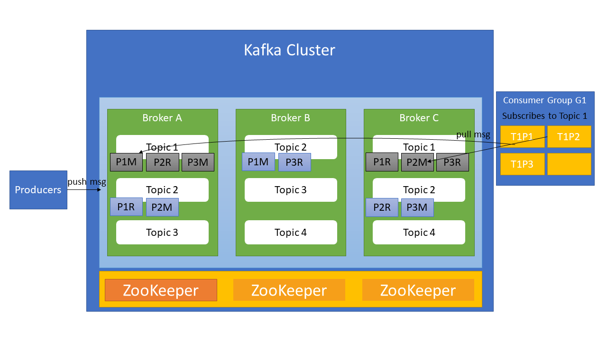

# OSB-Kafka
- [OSB-Kafka](#osb-kafka)
  - [Overview TODO](#overview-todo)
    - [Key Features](#key-features)
    - [Software used by OSB-Kafka](#software-used-by-osb-kafka)
    - [Cluster TODO](#cluster-todo)
      - [Terminology:](#terminology)
  - [Requirements](#requirements)
  - [How to](#how-to)
    - [Create a Service Instance](#create-a-service-instance)
    - [Update a Service Instance](#update-a-service-instance)
    - [Create a Service Binding](#create-a-service-binding)
    - [Acquiring Service Instance Parameters](#acquiring-service-instance-parameters)
    - [Change SSL Certificates](#change-ssl-certificates)
  - [Settings TODO](#settings-todo)
    - [Service Instance Settings Schema TODO](#service-instance-settings-schema-todo)
      - [logging object](#logging-object)
      - [config object](#config-object)
      - [security object](#security-object)
      - [users object](#users-object)
    - [Service Instance Zookeper Schema](#service-instance-zookeper-schema)
    - [Service Binding Settings Schema](#service-binding-settings-schema)
      - [topic_acls object](#topic_acls-object)
      - [group_acls](#group_acls)
      - [cluster_acls object](#cluster_acls-object)
  - [FAQ](#faq)
    - [OSB-Kafka crashed](#osb-kafka-crashed)
    - [A Kafka master/replica instance crashed](#a-kafka-masterreplica-instance-crashed)
    - [The size of the backup was bigger than expected (and failed) and now all of my storage space is occupied TODO](#the-size-of-the-backup-was-bigger-than-expected-and-failed-and-now-all-of-my-storage-space-is-occupied-todo)
  - [Appendix](#appendix)
    - [JSON-Schema](#json-schema)

---

## Overview TODO

[Apache Kafka](https://kafka.apache.org/) is one of the most popular event streaming platforms that offers high-performance data pipelines, streaming analytics, data integration and mission-critical applications. Event streaming allows for publishing (writing) and subscribing (reading) streams of events in real-time.

### Key Features

Some of Apache Kafkas key features are:

- **High throughput**: Messages can be delivered at network limited throughput and can be as low as 2ms.
- **Scalability**: Apache Kafka can be scaled up by increasing the number of brokers in order to maintain load balance. Since Kafka brokers are stateless, ZooKeeper is used for maintaining their cluster state. Kafka broker leader election is also done by ZooKeeper.
- **High-availability**: Multiple Kafka brokers replicate other ones to make data fault-tolerant and highly-available.
- **APIs**: Kafka exposes all its functionality over a language independent protocol which has clients in many programming languages. Kafka includes five core APIs:
  - Producer API
  - Consumer API
  - Streams API
  - Connect API
  - Admin API

  For more information, see the [documentation](https://kafka.apache.org/documentation/#api).
- **Client libraries**: There are client libraries available as independent open-source projects for many languages, for example C/C++, Python, Go, Node.js and PHP. A comprehensive list can be found [here](https://cwiki.apache.org/confluence/display/KAFKA/Clients). However, only the Java clients are maintained as part of the main Kafka project.

The OSB-Kafka offers different service plans which vary in allocated memory, cpu, disc-size and number of vms created for PostgreSQL.

### Software used by OSB-Kafka
- **Kafka**: 2.12?

### Cluster TODO

#### Terminology:

- Broker: Brokers form the storage layer of a Kafka cluster. Partitions of topics are spread on different brokers.
- Topic: Topics durably store events/messages. Producers/Consumers access only the topic specified. E.g. if a consumer subscribes to the topic "monitoring" it will only consume the events/messages stored in "monitoring". After consumption, events are not deleted from the topic. Replication is performed at the level of topic-partitions.
- Partition: Events of a topic are spread over a number of paritions which are located on different Kafka brokers. E.g. if there are 10 partitions for a topic and 2 brokers, each broker stores 5 partitions. If replication is performed, each partition is replicated and (if possible) the partition replicas are stored in different brokers than their masters and other replicas of the same partition.

The access to the master partitions is spread evenly among multiple consumers in a consumer group but it is also possible to access the same partition if a key is used. In case of a failure of a broker, the partition replicas stored in other brokers will be elected as partition masters so that the cluster will still work as intended.

Zookeper is used for monitoring the health of the brokers, configuration of topics, keeping track of the locations of partitions (masters and replicas) and electing a partition replica as new master.

The following image shows, how a Kafka Cluster is managed:


For the sake of simplicity, only topic 1 and 2 are looked at. Each topic consists of 3 partitions with 1 replication each (6 partitions per topic in total). Since the partitions of topic 1 (grey, "M"=master, "R"=replica) are spread across 2 brokers (broker A and broker B), each one stores 3 partitions. The partitions of topic 2 (light blue) are spread among 3 brokers, therefore each one stores 2 partitions. Master and replica partitions are distributed as evenly as possible. The consumer group G1 consists of 4 consumers. In case of no further configuration, each consumer of the group reads from a different partition, which means that the fourth consumer does not access any partition.

?warum hatten manche topics roten rand? weg

Further information about Kafka Clusters can be found [here](https://kafka.apache.org/documentation/).

## Requirements
- [Cloud Foundry CLI](https://docs.cloudfoundry.org/cf-cli/install-go-cli.html)

## How to
### Create a Service Instance

A service instance can be created manually via the CLI-Command
```
cf create-service SERVICE PLAN SERVICE_INSTANCE [-b BROKER] [-c PARAMETERS_AS_JSON] [-t TAGS]
```

- **SERVICE** will be the name of the service broker which is likely going to be **osb-kafka**.
- **PLAN** is a plan offered by the service.
- **SERVICE_INSTANCE** the name of the service instance, can be chosen freely.
- **PARAMETERS_AS_JSON** contains the settings shown in [Settings](#settings).

For more information see [Cloud Foundry CLI Reference Guide](https://cli.cloudfoundry.org/en-US/v6/create-service.html).

Aternatively, if there is a dashboard set up (like the Stratos Dashboard for example), it can be used to create a service instance.

### Update a Service Instance

A service instance (and therefore its settings) can be updated manually via the CLI-Command
```
cf update-service SERVICE_INSTANCE [-p NEW_PLAN] [-c PARAMETERS_AS_JSON] [-t TAGS] [--upgrade]
```

- **SERVICE_INSTANCE** is be the name of the previously created service instance.
- **PARAMETERS_AS_JSON** contains the settings shown in [Settings](#settings)

For more information see [Cloud Foundry CLI Reference Guide](https://cli.cloudfoundry.org/en-US/v6/update-service.html).

Aternatively, if there is a dashboard set up (like the Stratos Dashboard for example), it can be used to update a service instance.

Keep in mind that **previous values will be overwritten**. In order to see the existing parameters you can use a dashboard or acquire the parameters via cli (see [Acquiring Service Instance Parameters](#acquiring-service-instance-parameters)).

### Create a Service Binding

A binding can be created manually via the CLI-Command 
```
cf bind-service APP_NAME SERVICE_INSTANCE [-c PARAMETERS_AS_JSON] [--binding-name BINDING_NAME]
```

- **APP_NAME** ist the name of the previously created app that gets the binding injected.
- **SERVICE_INSTANCE** is be the name of the previously created service instance.
- **PARAMETERS_AS_JSON** contains the settings shown in [Settings](#service-binding-settings-schema).


For more information see [Cloud Foundry CLI Reference Guide](https://cli.cloudfoundry.org/en-US/v6/bind-service.html).
After creating a binding, the app has to be restarted for the changes to take effect.

TODO
Aternatively, if there is a dashboard set up (like the Stratos Dashboard for example), it can be used to create a service binding.

### Acquiring Service Instance Parameters

The current parameters (and therefore settings) can be retrieved via cli:

1. ```cf service --guid **SERVICE_INSTANCE**```
2. ```cf curl v3/service_instances/**SERVICE_INSTANCE_ID**/parameters```
3. A JSON with the parameters will be returned.

- **SERVICE_INSTANCE** is be the name of the previously created service instance.
- **SERVICE_INSTANCE_ID** is the guid of the service instance which is acquired in step 1. 

### Change SSL Certificates

The certificates expire after 365 day. If a certificate is about to expire, contact the operator of the Service Broker to renew the certificates.

If Bosh DNS is used, the certificates are stored in Credhub and can be renewed there. If the root CA is still valid, the certificate can simply be deleted and the new certificate can be used via `bosh manifest`and `bosh deploy`. If the root CA expires, it is necessary to concatenate old and new certificates, for example via [https://github.com/pivotal/credhub-release/blob/main/docs/ca-rotation.md](https://github.com/pivotal/credhub-release/blob/main/docs/ca-rotation.md).</br>
If the IP variant is used and the root CA still valid, it is sufficient to use `bosh recreate`. For changing the root CA, it also has to be concatenated and multiple deploys have to be made.

> **_IMPORTANT:_** Only the SSL certificates of the Kafka instances have to be renewed.

## Settings TODO
This section covers different settings that can be made for the OSB-Kafka, their default values and how they can be changed.

Settings can be sent as parameters of a create/update request of a service instance via CLI.

TThe CLI command will look like this:
```
cf cs SERVIE PLAN SERVICE_INSTANCE_ [-c PARAMETERS_AS_JSON]
```
or
```
cf update-service SERVICE_INSTANCE [-c PARAMETERS_AS_JSON]
```
- **SERVICE** will be the name of the service broker which is likely going to be **osb-kafka**.
- **PLAN** is the plan that is going to be used for the service instance.
- **SERVICE_INSTANCE** is the name of the service instance.
- **PARAMETERS_AS_JSON** are the settings which are sent in json format.

For example, a cli command for creating a service instance could look like this:
```
cf cs osb-kafka s kafka-test -c '{"kafka":{"logging": {"log_level": "INFO"}, "config":{"num_partitions": 3}}}'
```
An extended example of the parameters for a create/update request for a service instance is shown below:
```json
{
    "kafka": {
      "logging": {
        "log_level": "WARN",
        "max_file_size": "1GB",
        "max_backup_index": 10
      },
      "config": {
        "delete_topic": 0,
        "log_retention_check_interval_ms": 250000,
        "log_retention_hours": 140,
        "log_segment_bytes": 1073741824,
        "max_poll_intervall": 6000,
        "num_io_threads": 10,
        "num_network_threads": 4,
        "num_partitions": 2,
        "num_recovery_threads_per_data_dir": 1,
        "offsets_topic_replication_factor": 3,
        "socket_receive_buffer_bytes": 102400,
        "socket_request_max_bytes": 104857600,
        "socket_send_buffer_bytes": 102400
      },
      "security": {
        "setup_secure_client_connection": 0
      },
      "users": [
        {
          "username": "test",
          "password": "test"
        }
      ]
    },
    "zookeeper": {
      "config": {
        "autopurge_purge_interval": 20,
        "autopurge_snap_retain_count": 4,
        "cnx_timeout": 5,
        "election_algorim": 3,
        "force_sync": "yes",
        "global_outstanding_limit": 900,
        "init_limit": 6,
        "leader_serves": "yes",
        "max_client_connections": 70,
        "max_session_timeout": 40000,
        "min_session_timeout": 5000,
        "pre_allocation_size": 65536,
        "snap_count": 100000,
        "sync_enabled": true,
        "sync_limit": 2,
        "tick_time": 2000,
        "warning_threshold_limit": 1000
      }
    }
}
```

### Service Instance Settings Schema TODO

The following settings are defined in the schema in service_plan.schemas.service_instance.**create**.parameters.properties.kafka.properties and service_plan.schemas.service_instance.**update**.parameters.properties.kafka.properties.

| Parameter | Type | Default Value | Description |
| - | - | - | - |
| logging | [logging object](#logging-object) | - | Contains properties for the logging. |
| config | [config object](#config-object) | - | Contains general settings. |
| security | [security object](#security-object) | -  | Contains security settings. |
| user | array of [users objects](#users-object) | - | Contains the users for Kafka. |

#### logging object

| Parameter | Type | Default Value | Description |
| - | - | - | - |
| log_level | string | "INFO" | Sets the level of kafka logs. Valid values are "ALL", "DEBUG", "INFO", "WARN", "ERROR", "FATAL", "OFF" and "TRACE". If a logging object is given, this property is **required**. |
| max_file_size | string | "10MB" | Sets the maximum Log4j file size (KB, MB, GB). The value must match the pattern "^[1-9][0-9]*[KMG]B$". If a logging object is given, this property is **required**.|
| max_backup_index | number | 9 | Maximum number of Log4j backup log files. If a logging object is given, this property is **required**. |

#### config object

| Parameter | Type | Default Value | Description |
| - | - | - | - |
| delete_topic | boolean | 0 | Sets, whether autamically generated topics should be deleted if empty. If a config object is given, this property is **required**. |
| log_retention_check_interval_ms | number | 300000 | The log retention check interval. If a config object is given, this property is **required**. |
| log_retention_hours | number | 168 | Duration of the log retention in hours. If a config object is given, this property is **required**. |
| log_segment_bytes | number | 1073741824 | The size of log segments in bytes. If a config object is given, this property is **required**. |
| max_poll_interval | number | 5000 | The maximum polling interval in ms. If a config object is given, this property is **required**. |
| num_io_threads | number | 8 | Number of threads doing disk I/O. If a config object is given, this property is **required**. |
| num_network_threads | number | 4 | Number of Threads handling network requests. If a config object is given, this property is **required**. |
| num_partitions | number | 1 | Number of log partitions. If a config object is given, this property is **required**. |
| num_recovery_threads_per_data_dir | number | 1 | Number of recovery threads. If a config object is given, this property is **required**. |
| offsets_topic_replication_factor | number | 3 | Offsets topic replication factor. If a config object is given, this property is **required**. |
| socket_receive_buffer_bytes | number | 102400 | Receive buffer in bytes. If a config object is given, this property is **required**. |
| socket_request_max_bytes | number | 104857600 | Maximum request size accepted in bytes. If a config object is given, this property is **required**. |
| socket_send_buffer_bytes | number | 102400 | Send buffer in bytes. If a config object is given, this property is **required**. |

#### security object

| Parameter | Type | Default Value | Description |
| - | - | - | - |
| setup_secure_client_connection | boolean | 0 | Secure client connection. If a security object is given, this property is **required**. |

#### users object

| Parameter | Type | Default Value | Description |
| - | - | - | - |
| username | string | - | The username. The value must match the pattern ^[A-Za-z0-9_-]+$. If a users object is given, this property is **required**. |
| password | string | - | If a users object is given, this property is **required**. |

### Service Instance Zookeper Schema

| Parameter | Type | Default Value | Description |
| - | - | - | - |
| autopurge_purge_interval | number | 24(stunden?) | Autopurge interval. If a Zookeper object is given, this property is **required**. |
| autopurge_snap_retain_count | number | 3 | Autopurge snap(shot?) retain count. If a Zookeper object is given, this property is **required**. |
| cnx_timeout | number | 5(stunden?) | CNX timeout. If a Zookeper object is given, this property is **required**. |
| election_algorim | number | 3 | Election algorithm (to avoid confusion: there is a typo in the property name)(wofür steht welche nummer?). If a Zookeper object is given, this property is **required**. |
| force_sync | string | "yes" | Force synchronization. Valid values are "yes" and "no" (warum kein enum im schema? hinzgefügt). If a Zookeper object is given, this property is **required**. |
| global_outstanding_limit | number | 1000 | Global outstanding limit (weiß der nutzer was damit gemeint ist? ich nicht). If a Zookeper object is given, this property is **required**. |
| init_limit | number | 5 | Connection retries. If a Zookeper object is given, this property is **required**. |
| leader_serves | string | "yes" | Client connections to leader. Valid values are "yes" and "no" (?enum ergänzt). If a Zookeper object is given, this property is **required**. |
| max_client_connections | number | 60 | Maximum number of client connections. If a Zookeper object is given, this property is **required**. |
| max_session_timeout | number | 40000 | Maximum session timeout in ms. If a Zookeper object is given, this property is **required**. |
| min_session_timeout | number | 4000 | Minimum session timeout in ms. If a Zookeper object is given, this property is **required**. |
| pre_allocation_size | number | 65536 | Pre-allocation size for transaction log blocks (KB). If a Zookeper object is given, this property is **required**. |
| snap_count | number | 100000 | Snap(shot?) count. If a Zookeper object is given, this property is **required**. |
| sync_enabled | boolean | true | Synchronization enabled. If a Zookeper object is given, this property is **required**. |
| sync_limit | number | 2 | Synchronization limit. If a Zookeper object is given, this property is **required**. |
| tick_time | number | 2000 | Single tick time (in ms?). If a Zookeper object is given, this property is **required**. |
| warning_threshold_ms | number | 1000 | Warning threshold in ms. If a Zookeper object is given, this property is **required**.  | 

### Service Binding Settings Schema

The following settings are defined in the schema in service_plan.schemas.service_binding.**create**.parameters.properties
An extended example of the parameters for a create request for a service binding is shown below:
```json
{
  "service_key_name": "servicekey",
  "topic_acls": [
    {
      "topic": "mytopic",
      "rights": [
        "Read",
        "Write"
      ]
    }
  ],
  "group_acls": [
    {
      "group": "mygroup",
      "rights": [
        "All"
      ]
    }
  ],
  "cluster_acls": [
    {
      "rights": [
        "ClusterAction",
        "Describe"
      ]
    }
  ]
}
```

| Parameter | Type | Default Value | Description |
| - | - | - | - |
| service_key_name | string | - | The name of the service binding. This parameter is **required**. |
| topic_acls | array of [topic_acls objects](#topic_acls-object) | - | ? |
| group_acls | array of [group_acls objects](#group_acls-object) | - | ? |
| cluster_acls | array of [cluster_acls objects](#cluster_acls-object) | - | ? |

#### topic_acls object

blabla?

| Parameter | Type | Default Value | Description |
| - | - | - | - |
| topic | string | * | The name of the topic to be created?. ?hier regex? If a topic_acls object is given, this parameter is **required**. |
| rights | array of string | - | Sets the rights of the topic (?). Valid values are "All", "Alter", "AlterConfigs", "Create", "Delete", "Describe", "DescribeConfigs", "Read" and "Write". If a topic_acls object is given, this parameter is **required**. |

#### group_acls 

| Parameter | Type | Default Value | Description |
| - | - | - | - |
| group | string | * | Name of a (consumer?producer? egal?) group?. If a group_acls object is given, this parameter is **required**. |
| rights | array of string | "All" | Sets the rights of the group. Valid values are "All", "Delete", "Describe" and "Read". If a group_acls object is given, this parameter is **required**. |

#### cluster_acls object

Warum ist cluster_acls als array of objects definiert, wenn "maxItems: 1"? Macht das array da überhaupt Sinn?

| Parameter | Type | Default Value | Description |
| - | - | - | - |
| rights | array of string | "All" | Sets the rights of the cluster?. Valid values are "All", "Alter", "AlterConfigs", "ClusterAction", "Create", "Describe", "DescribeConfigs", "IdempotentWrite". If a cluster_acls object is given, this parameter is **required**. |

## FAQ

### OSB-Kafka crashed

If the service broker crashes, the operator should be contacted.

### A Kafka master/replica instance crashed

As long as there is at least one replica partition of a lost master partition or the master partition running after an instance failed, Kafka is still functional.

The following causes can lead to a failure: ?passt das noch?
- IaaS problems with VMs, network or storage
- Storage space completely occupied
- SSL certificates expired
- Automatic Failover requires Zookeeper

Access to the VM via [Bosh CLI](https://bosh.io/docs/cli-v2/) is required for debugging. The logs of Kafka can be acquired within the VM under:

```
/var/vcap/sys/log/redis/?ALL?
```
??hiweis auf redis-cli? unter /var/vcap/packages/redis/bin

If the error **cannot be fixed**, a new instance has to be created and restored by using a backup.

### The size of the backup was bigger than expected (and failed) and now all of my storage space is occupied TODO

In this case, contact the operator.

## Appendix

### JSON-Schema

```
schemas: &schemas
        service_binding:
          create:
            parameters:
              properties:
                service_key_name:
                  title: Service Key name
                  type: string
                topic_acls:
                  type: array 
                  items:
                  - properties:
                      topic:
                        type: string
                        default: '*'
                      rights:
                        type: array
                        uniqueItems: true
                        items: 
                        - type: string
                          enums:
                          - All
                          - Alter
                          - AlterConfigs
                          - Create
                          - Delete
                          - Describe
                          - DescribeConfigs
                          - Read
                          - Write
                    type: object
                    required:
                    - topic
                    - rights
                group_acls:
                  type: array
                  items:
                  - properties:
                      group:
                        type: string
                        default: '*'
                      rights:
                        type: array
                        uniqueItems: true
                        items: 
                        - type: string
                          enums:
                          - All
                          - Delete
                          - Describe
                          - Read
                        default: 'All'
                    type: object
                    required:
                    - group
                    - rights
                cluster_acls:
                  type: array
                  maxItems: 1
                  items:
                  - properties:
                      rights:
                        type: array
                        uniqueItems: true
                        items: 
                        - type: string
                          enums:
                          - All
                          - Alter
                          - AlterConfigs
                          - ClusterAction
                          - Create
                          - Describe
                          - DescribeConfigs
                          - IdempotentWrite
                        default: 'All'
                    type: object
                    required:
                    - rights
              required:
              - service_key_name
              schema: http://json-schema.org/draft-04/schema#
              type: object
              title: Service Key Parameters
        service_instance:
          create: &createUpdate
            parameters:
              properties:
                kafka:
                  properties:
                    logging:
                      properties:
                        log_level:
                          default: "INFO"
                          enums:
                            - ALL
                            - DEBUG
                            - INFO
                            - WARN
                            - ERROR
                            - FATAL
                            - OFF
                            - TRACE
                          title: Kafka Log Level (ALL, DEBUG, INFO, WARN, ERROR, FATAL, OFF, TRACE)
                          type: string
                        max_file_size:
                          default: "10MB"
                          title: Maximum Log4j File Size (KB, MB, GB)
                          pattern: "^[1-9][0-9]*[KMG]B$"
                          type: string
                        max_backup_index:
                          default: 9
                          title: Maximum Log4j Backup Log Files
                          type: number
                      required:
                      - log_level
                      - max_file_size
                      - max_backup_index
                      title: Log Rotation
                      type: object
                    config:
                      properties:
                        delete_topic:
                          default: 0
                          title: Topic Deletion
                          type: boolean
                        log_retention_check_interval_ms:
                          default: 300000
                          title: Log Retention Check Interval (ms)
                          type: number
                        log_retention_hours:
                          default: 168
                          title: Log retention hours
                          type: number
                        log_segment_bytes:
                          default: 1073741824
                          title: Log segment size (bytes)
                          type: number
                        max_poll_interval:
                          default: 5000
                          title: Maximum Polling Interval (ms)
                          type: number
                        num_io_threads:
                          default: 8
                          title: Number of threads doing disk I/O
                          type: number
                        num_network_threads:
                          default: 4
                          title: Number of Threads handling network requests
                          type: number
                        num_partitions:
                          default: 1
                          title: Number of log partitions
                          type: number
                        num_recovery_threads_per_data_dir:
                          default: 1
                          title: Number of recovery threads
                          type: number
                        offsets_topic_replication_factor:
                          default: 3
                          title: Offsets Topic Replication Factor
                          type: number
                        socket_receive_buffer_bytes:
                          default: 102400
                          title: Receive Buffer (bytes)
                          type: number
                        socket_request_max_bytes:
                          default: 104857600
                          title: Maximum request size accepted (bytes)
                          type: number
                        socket_send_buffer_bytes:
                          default: 102400
                          title: Send Buffer (bytes)
                          type: number
                      required:
                      - delete_topic
                      - max_poll_interval
                      - offsets_topic_replication_factor
                      - num_network_threads
                      - num_io_threads
                      - socket_send_buffer_bytes
                      - socket_receive_buffer_bytes
                      - socket_request_max_bytes
                      - num_partitions
                      - num_recovery_threads_per_data_dir
                      - log_retention_hours
                      - log_retention_check_interval_ms
                      - log_segment_bytes
                      title: General Settings
                      type: object
                    security:
                      properties:
                        setup_secure_client_connection:
                          default: 0
                          title: Secure Client Connection
                          type: boolean
                        #acl:
                        #  properties:
                        #    enabled:
                        #      type: boolean
                        #      default: true
                        #      title: Acl Enabled
                        #    without-acl-allow-all:
                        #      type: boolean
                        #      default: false
                        #      title: Allow all when no ACL exist
                        #  type: object
                        #  required:
                        #  - enabled
                        #  - without-acl-allow-all
                      required:
                      - setup_secure_client_connection
                      #- acl
                      title: Security Settings
                      type: object
                    users:
                      type: array
                      items:
                      - properties:
                          password:
                            type: string
                          username:
                            pattern: ^[A-Za-z0-9_-]+$
                            type: string
                        required:
                        - username
                        - password
                        type: object
                  title: Kafka Configuration
                  type: object
                zookeeper:
                  properties:
                    config:
                      properties:
                        autopurge_purge_interval:
                          default: 24
                          title: Autopurge Interval
                          type: number
                        autopurge_snap_retain_count:
                          default: 3
                          title: Autopurge Snap Retain Count
                          type: number
                        cnx_timeout:
                          default: 5
                          title: CNX Timeout
                          type: number
                        election_algorim:
                          default: 3
                          title: Election Implementation
                          type: number
                        force_sync:
                          default: "yes"
                          enums:
                            - yes
                            - no
                          title: Force Synchronization (yes/no)
                          type: string
                        global_outstanding_limit:
                          default: 1000
                          title: Global Outstanding Limit
                          type: number
                        init_limit:
                          default: 5
                          title: Connection Retries
                          type: number
                        leader_serves:
                          default: "yes"
                          enums:
                            - yes
                            - no
                          title: Client Connections To Leader (yes/no)
                          type: string
                        max_client_connections:
                          default: 60
                          title: Maximum Client Connections
                          type: number
                        max_session_timeout:
                          default: 40000
                          title: Maximum Session Timeout (ms)
                          type: number
                        min_session_timeout:
                          default: 4000
                          title: Minimum Session Timeout (ms)
                          type: number
                        pre_allocation_size:
                          default: 65536
                          title: Pre-Allocation Size For Transaction Log Blocks (kb)
                          type: number
                        snap_count:
                          default: 100000
                          title: Snap Count
                          type: number
                        sync_enabled:
                          default: true
                          title: Enable Synchronization
                          type: boolean
                        sync_limit:
                          default: 2
                          title: Synchronization Limit
                          type: number
                        tick_time:
                          default: 2000
                          title: Single Tick Time
                          type: number
                        warning_threshold_ms:
                          default: 1000
                          title: Warning Threshold (ms)
                          type: number
                      required:
                      - autopurge_purge_interval
                      - autopurge_snap_retain_count
                      - cnx_timeout
                      - election_algorim
                      - warning_threshold_ms
                      - global_outstanding_limit
                      - init_limit
                      - leader_serves
                      - max_client_connections
                      - max_session_timeout
                      - min_session_timeout
                      - pre_allocation_size
                      - snap_count
                      - sync_enabled
                      - sync_limit
                      - tick_time
                      - force_sync
                      title: General Settings
                      type: object
                  title: General Zookeeper Settings
                  type: object
              schema: http://json-schema.org/draft-06/schema
              type: object
          update: *createUpdate
```