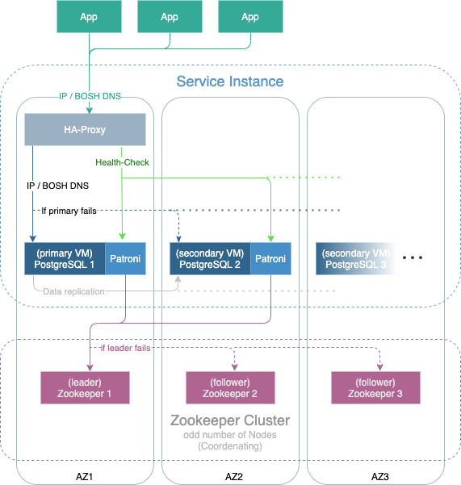

# OSB-PostgreSQL
- [OSB-PostgreSQL](#osb-postgresql)
  - [Overview](#overview)
    - [Software used by OSB-PostgreSQL](#software-used-by-osb-postgresql)
    - [Cluster](#cluster)
  - [Requirements](#requirements)
  - [How to](#how-to)
    - [Create a Service Instance](#create-a-service-instance)
    - [Update a Service Instance](#update-a-service-instance)
    - [Create a Service Binding](#create-a-service-binding)
    - [Acquiring Service Instance Parameters](#acquiring-service-instance-parameters)
    - [Backup](#backup)
    - [Change SSL Certificates](#change-ssl-certificates)
  - [Settings](#settings)
    - [Service Instance Settings Schema](#service-instance-settings-schema)
      - [SSL object (service instance)](#ssl-object-service-instance)
      - [Database object](#database-object)
      - [Config object (database)](#config-object-database)
      - [Config object (service instance)](#config-object-service-instance)
      - [Databases object](#databases-object)
      - [Users object](#users-object)
      - [Replication object](#replication-object)
      - [Resource object](#resource-object)
      - [Logging object](#logging-object)
    - [Service Binding Settings Schema](#service-binding-settings-schema)
  - [FAQ](#faq)
    - [OSB-PostgreSQL crashed](#osb-postgresql-crashed)
    - [A PostgreSQL instance crashed](#a-postgresql-instance-crashed)
    - [The size of the backup was bigger than expected (and failed) and now all of my storage space is occupied](#the-size-of-the-backup-was-bigger-than-expected-and-failed-and-now-all-of-my-storage-space-is-occupied)
  - [Appendix](#appendix)
    - [JSON-Schema](#json-schema)

---

## Overview
[PostgreSQL](https://www.postgresql.org/) is a powerful, object-relational open-source database-system. It has actively been developed for over 30 years
and earned a good reputation in regard to reliability, robustness of functions and performance. <br>
This project is part of our service broker project. For documentation of the service broker see [evoila/osb-docs](https://github.com/evoila/osb-docs).

The OSB-PostgreSQL offers different service plans which vary in allocated memory, cpu, disc-size and number of vms created for PostgreSQL.

### Software used by OSB-PostgreSQL
- **PostgreSQL**: 12.9, 13.5, 14.1
- **PostGIS**:  3.0.3
- **Patroni**: 2.0.2

### Cluster

Using PostgreSQL, it is possible to transfer [Write-Ahead Logging (WAL)](https://www.postgresql.org/docs/current/wal-intro.html)
synchronously or asynchronously to standby-nodes via [Streaming Replication (SR)](https://www.postgresql.org/docs/current/warm-standby.html#STREAMING-REPLICATION). <br>
Additionally, the Software "Patroni" is used with a HAProxy inside the OSB, so that an automatic switch to another node occurs
in case of a failure of the primary-node. Inside PostgreSQL, there is no load-balancing provided.

The following image shows how PostgreSQL nodes are managed:


An HAProxy conists of at least 2 PostgeSQL nodes that are connected via Streaming Replication. Patroni exists on every PostgreSQL node for automatic failover. A central IP or DNS entry is returned by HAProxy. The health check is done by Patroni: In case of failure the primary node will be switched automatically and HAProxy will be set to this one. In order for Patroni to manage the clusters, a central Zookeeper cluster with 3 or 5 instances will be used for all PostgreSQL clusters.

## Requirements
- [Cloud Foundry CLI](https://docs.cloudfoundry.org/cf-cli/install-go-cli.html)

## How to
### Create a Service Instance

A service instance can be created manually via the CLI-Command
```
cf create-service SERVICE PLAN SERVICE_INSTANCE [-b BROKER] [-c PARAMETERS_AS_JSON] [-t TAGS]
```

- **SERVICE** will be the name of the service broker which is likely going to be **osb-postgresql**.
- **PLAN** is a plan offered by the service.
- **SERVICE_INSTANCE** the name of the service instance, can be chosen freely.
- **PARAMETERS_AS_JSON** contains the settings shown in [Settings](#settings).

For more information see [Cloud Foundry CLI Reference Guide](https://cli.cloudfoundry.org/en-US/v6/create-service.html).

Aternatively, if there is a dashboard set up (like the Stratos Dashboard for example), it can be used to create a service instance.

### Update a Service Instance

A service instance (and therefore its settings) can be updated manually via the CLI-Command
```
cf update-service SERVICE_INSTANCE [-p NEW_PLAN] [-c PARAMETERS_AS_JSON] [-t TAGS] [--upgrade]
```

- **SERVICE_INSTANCE** is be the name of the previously created service instance.
- **PARAMETERS_AS_JSON** contains the settings shown in [Settings](#settings)

For more information see [Cloud Foundry CLI Reference Guide](https://cli.cloudfoundry.org/en-US/v6/update-service.html).


Aternatively, if there is a dashboard set up (like the Stratos Dashboard for example), it can be used to update a service instance.

Keep in mind that **previous values will be overwritten**. In order to see the existing parameters you can use a dashboard or acquire the parameters via cli (see [Acquiring Service Instance Parameters](#acquiring-service-instance-parameters)).

### Create a Service Binding

A binding can be created manually via the CLI-Command 
```
cf bind-service APP_NAME SERVICE_INSTANCE [-c PARAMETERS_AS_JSON] [--binding-name BINDING_NAME]
```

- **APP_NAME** ist the name of the previously created app that gets the binding injected.
- **SERVICE_INSTANCE** is be the name of the previously created service instance.
- **PARAMETERS_AS_JSON** contains the settings shown in [Settings](#service-binding-settings-schema).


For more information see [Cloud Foundry CLI Reference Guide](https://cli.cloudfoundry.org/en-US/v6/bind-service.html).
After creating a binding, the app has to be restarted for the changes to take effect.

Aternatively, if there is a dashboard set up (like the Stratos Dashboard for example), it can be used to create a service binding.

### Acquiring Service Instance Parameters

The current parameters (and therefore settings) can be retrieved via cli:

1. ```cf service --guid **SERVICE_INSTANCE**```
2. ```cf curl v3/service_instances/**SERVICE_INSTANCE_ID**/parameters```
3. A JSON will be returned. The settings can be found inside the field **postgres**.

- **SERVICE_INSTANCE** is be the name of the previously created service instance.
- **SERVICE_INSTANCE_ID** is the guid of the service instance which is acquired in step 1. 


### Backup

When creating an instance, the disk-space should be calculated. It is important to keep in mind that there is enough space for files, backup and WAL (Write Ahead Log) segments. The backup size can vary, depending on data type and indices:

- If there are many big files of type TEXT / JSONB / JSON / BYTEA, the backup size can be 1.5 times bigger than the database itself.
- If there are many indices the backup size can shrink to 0.25 the current size.
- The size of a plan can be scaled up afterwards but this will copy the disk. In order to avoid subsequent changes a fitting plan should be chosen according to the following rule: `Files * ( 1 + Backup Factor ) + max_wal_size `. Thereby the required space can go up to 2.5 times the size plus ~10GB WAL-files.

Setting up a backup can be done the dashboard-url of the service instance (which can be retrieved by the cli command **cf service SERVICE_INSTANCE**). For more information, see the Backup Docs.

> **_IMPORTANT:_** Do **not** create/restore a backup of *template 0*, *template 1* and *backup*  as this will lead to a failure of the backup/restore job.

### Change SSL Certificates

The certificates expire after 365 day. If a certificate is about to expire, contact the operator of the Service Broker to renew the certificates.

If Bosh DNS is used, the certificates are stored in Credhub and can be renewed there. If the root CA is still valid, the certificate can simply be deleted and the new certificate can be used via `bosh manifest`and `bosh deploy`. If the root CA expires, it is necessary to concatenate old and new certificates, for example via [https://github.com/pivotal/credhub-release/blob/main/docs/ca-rotation.md](https://github.com/pivotal/credhub-release/blob/main/docs/ca-rotation.md).</br>
If the IP variant is used and the root CA still valid, it is sufficient to use `bosh recreate`. For changing the root CA, it also has to be concatenated and multiple deploys have to be made.

## Settings
This section covers different settings that can be made for the OSB-PostgreSQL, their default values and how they can be changed.

Settings can be sent as parameters of a create/update request of a service instance and a create request for a service binding (only SSL and database settings can be sent when creating a service binding, see [Service Binding](#service-binding-settings-schema)) via CLI.

The CLI command will look like this:
```
cf cs BROKERNAME PLAN SERVICENAME [-c PARAMETERS_AS_JSON]
```
- **BROKERNAME** will be the name of the service broker which is likely going to be **osb-postgresql**
- **PLAN** is the plan that is going to be used for the service instance
- **SERVICENAME** is the name of the service which is up to the user
- **PARAMETERS_AS_JSON** are the settings which are sent in json format

For example, a cli command for creating a service instance could look like this:
```
cf cs osb-postgresql s psql-test -c '{"postgres":{"ssl":{"enabled":true}}}'
```
An extended example of the parameters for a create/update request for a service instance is shown below:
```json
{
    "postgres": {
        "version": "14",
        "ssl": {
            "enabled": true,
            "max_protocol_version": "TLSv1.2"
        },
        "database": {
            "extensions": [
                "postgis",
                "postgis_topology",
                "fuzzystrmatch",
                "address_standardizer",
                "postgis_tiger_geocoder",
                "pg_trgm"
            ]
        },
        "config": {
            "authentication_timeout": 15,
            "max_locks_per_transaction": 15,
            "max_pred_locks_per_page": 15,
            "max_pred_locks_per_relation": 15,
            "max_pred_locks_per_transaction": 15
        },
        "databases": [
            {
                "name": "TestDB1",
                "users": [
                    "TestUser1",
                    "TestUser2"
                ],
                "extensions": [
                    "postgis",
                    "postgis_topology",
                    "fuzzystrmatch",
                    "address_standardizer",
                    "postgis_tiger_geocoder",
                    "pg _trgm"
                ]
            },
            {
                "name": "TestDB2",
                "users": [
                    "TestUser2",
                    "TestUser3"
                ]
            }
        ],
        "users": [
            {
                "username": "TestUser1",
                "password": "Test123"
            },
            {
                "username": "TestUser2",
                "password": "Test123",
                "admin": true
            },
            {
                "username": "TestUser3",
                "password": "Test123"
            }
        ]
    }
}
```

### Service Instance Settings Schema

The following settings are defined in the schema in service_plan.schemas.service_instance.**create**.parameters.properties.postgres.properties and service_plan.schemas.service_instance.**update**.parameters.properties.postgres.properties

| Parameter | Type | Default Value | Description |
| - | - | - | - |
| version* | string | | PostgreSQL version |
| ssl* | [SSL](#ssl-object-service-instance) object | | Settings for SSL certificates |
| database | [Database](#database-object) object | | Contains database exensions |
| config | [Config](#config-object-service-instance) object | | Contains settings for locks |
| databases | array of [Databases](#databases-object) objects | | Additional databases | 
| users | array of [Users](#users-object) objects | |  |
| replication | [Replication](#replication-object) object | | Contains settings for Write-Ahead Logging (WAL) |
| resource | [Resource](#resource-object) object | | Contains settings for resource management |
| logging | [Logging](#logging-object) object | | Contains settings for logs (frequency, naming, truncation) |

\* **ONLY** available when creating a service instance, **NOT** when updating. Even though the field **ssl** can be sent when updating, it **MUST NOT** be used (use at own risk). Can be used if there is no HAProxy needed (when there is only one PostgreSQL instance.

#### SSL object (service instance)
The SSL object contains settigs for SSL certificates and consists of the following properties:

| Parameter | Type | Default Value | Description |
| - | - | - | - |
| ssl.enabled | boolean | true | Activates check for SSL certificates |
| ssl.max_protocol_version | |	- |	Max SSL version TLSv1.3 bei Ubuntu Bionic <br/> Version TLS1.2 bei Ubuntu Xenial, Ubuntu Bionic |
| ssl.min_protocol_version | | - |	Min SSL version TLSv1.3 bei Ubuntu Bionic <br/> Version TLS1.2 und TLS1.1 bei Ubuntu Xenial, Ubuntu Bionic |

#### Database object

The database object contains extensions for the database and consists of the following properties:

| Parameter | Type | Default Value | Description |
| - | - | - | - |
| config | [Config](#config-object-database) object | | Configurations for the database|

#### Config object (database)


| Parameter | Type | Default Value | Description |
| - | - | - | - |
| extensions| array of strings | | An array of supported extensions* |

\*Valid values (of PostgreSQL 14) are:
- address_standardizer
- address_standardizer_data_us
- adminpack
- amcheck
- autoinc
- bloom
- bool_plperl
- bool_plperlu
- btree_gin
- btree_gist
- citext
- cube
- dblink
- dict_int
- dict_xsyn
- earthdistance
- file_fdw
- fuzzystrmatch
- hstore
- hstore_plperl
- hstore_plperlu
- hstore_plpython2u
- hstore_plpython3u
- hstore_plpythonu
- insert_username
- intagg
- intarray
- isn
- jsonb_plperl
- jsonb_plperlu
- jsonb_plpython2u
- jsonb_plpython3u
- jsonb_plpythonu
- lo
- ltree
- ltree_plpython2u
- ltree_plpython3u
- ltree_plpythonu
- moddatetime
- old_snapshot
- pageinspect
- pg_buffercache
- pgcrypto
- pg_freespacemap
- pg_prewarm
- pgrowlocks
- pg_stat_statements
- pgstattuple
- pg_surgery
- pg_trgm
- pg_visibility
- plperl
- plperlu
- plpgsql
- plpython3u
- postgis
- postgis_raster
- postgis_sfcgal
- postgis_tiger_geocoder
- postgis_topology
- postgres_fdw
- refint
- seg
- sslinfo
- tablefunc
- tcn
- tsm_system_rows
- tsm_system_time
- unaccent
- uuid-ossp
- xml2

#### Config object (service instance)
The config object contains the settings for locks and consists of the following properties:

| Parameter | Type | Default Value | Description |
| - | - | - | - |
| max_locks_per_transaction | integer | 64 | [runtime-config-locks](https://www.postgresql.org/docs/13/runtime-config-locks.html). Value MUST be set and value≥10 |
| max_pred_locks_per_transaction | integer | 64 | [runtime-config-locks](https://www.postgresql.org/docs/13/runtime-config-locks.html). Value MUST be set and value≥10 |
| max_pred_locks_per_relation | integer | -2 | [runtime-config-locks](https://www.postgresql.org/docs/13/runtime-config-locks.html). Value MUST be set|
| max_pred_locks_per_page | integer | 2 | [runtime-config-locks](https://www.postgresql.org/docs/13/runtime-config-locks.html). Value MUST be set and value≥1 |
| authentication_timeout | integer | 30 | Login time in seconds. Value MUST be set and value≥1 |
| max_connections | integer | 100 | Maximum number of connections that the server may accept. Changing the value requires postgresql to reallocate working memory which can only be applied after a restart after deploying. This can lead to a short downtime < 1s of postgresql. |
| max_prepared_transactions | integer | 0 | Max number of transactions that can be in the prepared state simultaneously. Setting this parameter to zero disables the prepared-transaction feature. |
| track_commit_timestamp | string | off | Record commit time of transactions. Value can be either on or off. |
| effective_io_concurrency        | integer | 1                                                       | Set the number of allowed parallel io-operations.                                                                                                                                                                                    |

#### Databases object

| Parameter | Type | Default Value | Description |
| - | - | - | - |
| name | string | | Name of the database |
| users | array of string | | List of users that can connect to the database. The value must match the pattern "^([A-Za-z0-9_-]+|\\(\\([A-Za-z0-9._-]+\\)\\))$". |
| extensions | array of string | | An array of supported extensions* |

\*Valid values can bee found in [Config object (database)](#config-object-database)

#### Users object

| Parameter | Type | Default Value | Description |
| - | - | - | - |
| admin | boolean | | Determines, whether the user is an admin |
| username | string | | Name of the user. The value must match the pattern '^([A-Za-z0-9_-]+|\(\([A-Za-z0-9._/-]+\)\))$'. MUST be set |
| password | string | | Password of the user. MUST be set |

#### Replication object

| Parameter | Type | Default Value | Description |
| - | - | - | - |
| max_wal_senders | integer | 10 | Maximum number of WAL senders. Minimum is 1 |
| wal_level | string | replica | Determines how much information is written to the WAL. Possible values are replica, minimal, logical and hot_standby (which is mapped to replica). |

#### Resource object

| Parameter                       | Type    | Default Value                                           | Description                                                                                                                                                                                                                          |
|---------------------------------|---------|---------------------------------------------------------|--------------------------------------------------------------------------------------------------------------------------------------------------------------------------------------------------------------------------------------|
| shared_buffers                  | string  | 0.25 * RAM                                              | Amount of memory used for shared memory buffers. Must match pattern ^[1-9][0-9]*[KMG]B$, e.g. 512MB. This value has to be adjusted to the available RAM                                                                              |
| temp_buffers                    | string  | 8MB                                                     | Maximum amount of memory used for temporary buffers within each database session. Must match pattern ^[1-9][0-9]*[KMG]B$                                                                                                             |
| effective_cache_size            | string  | 0.5 * RAMB                                              | Expected (estimate) memory to be available in the OS and buffer caches, used by query planner. Must match pattern ^[1-9][0-9]*[KMG]B$, e.g. 4096MB. This value has to be adjusted to the available RAM                               |
| maintenance_work_mem            | string  | maintenance_work_mem = 0.1 RAM / autovacuum_max_workers | Maximum amount of memory to be used by maintenance operations, such as VACUUM, CREATE INDEX, and ALTER TABLE ADD FOREIGN KEY. Must match pattern ^[1-9][0-9]*[KMG]B$, e.g. 256MB. This value has to be adjusted to the available RAM |
| work_mem                        | string  | work_mem = 0.25 * RAM / max_connections                 | Maximum amount of memory to be used by a query operation. Must match pattern ^[1-9][0-9]*[KMG]B$, e.g. 32MB. This value has to be adjusted to the available RAM                                                                      |
| min_wal_size                    | string  | 80MB                                                    | Minimum amount of memory reserved for WAL. As long as WAL disk usage stays below this setting, old WAL files are always recycled for future use at a checkpoint, rather than removed. Must match pattern ^[1-9][0-9]*[KMG]B$         |
| max_wal_size                    | string  | 1GB                                                     | Maximum size to let the WAL grow during automatic checkpoints. This is a soft limit. Must match pattern ^[1-9][0-9]*[KMG]B$                                                                                                          |
| max_parallel_workers_per_gather | integer | 2                                                       | Maximum number of workers that can be started by a single Gather or Gather Merge node                                                                                                                                                |
| max_parallel_workers            | integer | 8                                                       | Maximum number of workers that the system can support for parallel queries                                                                                                                                                           |
| max_files_per_process           | integer | 1000                                                    | Maximum number of simultaneously open files allowed to each server subprocess                                                                                                                                                        |
| max_worker_processes            | integer | 2                                                       | Sets the maximum number of background processes that the system can support.                                                                                                                                                         |

> **_IMPORTANT:_** While it is possible to declare the field wal_log_hints inside the Resource object, changes to its value will have no effect. This is caused by a bug auf Patroni, which states that changes have been made but does not actually apply them to Postgresql.

#### Logging object

| Parameter | Type | Default Value | Description |
| - | - | - | - |
| filename | string | postgresql-%a.log | The filename used for logs. Uses strftime (%-escapes) |
| rotation_age | integer | 1440 | Time (minutes) until a new log is created. Minimum is 1 |
| truncate_on_rotation | boolean | true | Truncate (overwrite) existing log files with the same name, rather than appending new logs |

### Service Binding Settings Schema

Within service_plan.schemas.service_binding.create.parameters.properties in the schema several fields are defined for a service binding:
| Parameter | Type | Default Value | Description |
| - | - | - | - |
| database | string | - | The database for the service binding |

The settings for the binding are **NOT** inside a field named "posgresql". An example for sending settings when creating a binding:

```
cf bind-service appname serviceinstancename -c '{"ssl":{"enabled":true}}'
```

## FAQ

### OSB-PostgreSQL crashed

If the service broker crashes, the operator should be contacted.

### A PostgreSQL instance crashed

As long as there is at least one PostgreSQL instance running after another instance failed, the database is still functional. The Bosh director will detect the failure and try to repair the broken instance. If an automatic repair of the instance is not possible, it has to be fixed manually.

The following causes can lead to a failure:
- IaaS problems with VMs, network or storage
- Storage space completely occupied
- SSL certificates expired
- Automatic Failover requires Zookeeper

Access to the VM via [Bosh CLI](https://bosh.io/docs/cli-v2/) is required for debugging. First, the following two files have to be acquired within the VM.

```
/var/vcap/jobs/postgres/config/pgenv
/var/vcap/jobs/postgres/helpers/patroni.env
```

Afterwards the state of the cluster can be retrieved with the command `$PATRONICTL -c $PATRONI_CONFIG list`.

**1 operational** Node:</br>
Run `$PATRONICTL -c $PATRONI_CONFIG reinit <Clustername>` and follow the cli instructions. The name of the cluster is inside the table of the list command and has the schema "sb-\<UUID\>".

There is **no primary** node:</br>
In this case it is necessary to view the logs in order to find the cause of failure. The following logs are relevant:

```
/var/vcap/sys/log/postgres/patroni.log
/var/vcap/sys/log/postgres/postgresql-<Datum>.log
```

While debugging, it is important to start the previous leader first. The primary node can be seen from the Patroni logs. If the PostgreSQL Job is not running it has to be restarted with the command `monit restart postgres`. Otherwise the cluster can be restarted with the command `$PATRONICTL -c $PATRONI_CONFIG restart <Clustername>`.

If the error **cannot be fixed**, a new instance has to be created and restored by using a backup.

### The size of the backup was bigger than expected (and failed) and now all of my storage space is occupied

In this case, contact the operator.

## Appendix

### JSON-Schema

```
schemas: &schemas
        service_binding:
          create:
            parameters:
              properties:
                database:
                  description: Specify the database for the service binding.
                  type: string
              schema: http://json-schema.org/draft-04/schema#
              type: object
              additionalProperties: false
        service_instance:
          update: &schemaproperties
            parameters:
              properties:
                postgres:
                  properties:
                    version:
                      type: string
                      default: "14"
                    ssl:
                      type: object
                      additionalProperties: false
                      properties:
                        enabled:
                          title: ssl enabled
                          type: boolean
                          default: true
                        min_protocol_version:
                          title: minimal TLS version
                          type: string
                          default: "TLSv1.2"
                          enums:
                          - TLSv1
                          - TLSv1.1
                          - TLSv1.2
                          - TLSv1.3
                          - ""
                        max_protocol_version:
                          title: minimal TLS version
                          type: string
                          default: "TLSv1.3"
                          enums:
                          - TLSv1
                          - TLSv1.1
                          - TLSv1.2
                          - TLSv1.3
                          - ""
                    database:
                      type: object
                      additionalProperties: false
                      properties:
                        extensions:
                          items:
                          - type: string
                            enums: &extension 
                            - address_standardizer
                            - address_standardizer_data_us
                            - adminpack
                            - amcheck
                            - autoinc
                            - bloom
                            - bool_plperl
                            - bool_plperlu
                            - btree_gin
                            - btree_gist
                            - citext
                            - cube
                            - dblink
                            - dict_int
                            - dict_xsyn
                            - earthdistance
                            - file_fdw
                            - fuzzystrmatch
                            - hstore
                            - hstore_plperl
                            - hstore_plperlu
                            - hstore_plpython2u
                            - hstore_plpython3u
                            - hstore_plpythonu
                            - insert_username
                            - intagg
                            - intarray
                            - isn
                            - jsonb_plperl
                            - jsonb_plperlu
                            - jsonb_plpython2u
                            - jsonb_plpython3u
                            - jsonb_plpythonu
                            - lo
                            - ltree
                            - ltree_plpython2u
                            - ltree_plpython3u
                            - ltree_plpythonu
                            - moddatetime
                            - old_snapshot
                            - pageinspect
                            - pg_buffercache
                            - pgcrypto
                            - pg_freespacemap
                            - pg_prewarm
                            - pgrowlocks
                            - pg_stat_statements
                            - pgstattuple
                            - pg_surgery
                            - pg_trgm
                            - pg_visibility
                            - plperl
                            - plperlu
                            - plpgsql
                            - plpython3u
                            - postgis
                            - postgis_raster
                            - postgis_sfcgal
                            - postgis_tiger_geocoder
                            - postgis_topology
                            - postgres_fdw
                            - refint
                            - seg
                            - sslinfo
                            - tablefunc
                            - tcn
                            - tsm_system_rows
                            - tsm_system_time
                            - unaccent
                            - uuid-ossp
                            - xml2
                          type: array
                    config:
                      properties:
                        authentication_timeout:
                          title: Authentication Timeout
                          type: integer
                          minimum: 1
                          default: 30
                        max_locks_per_transaction:
                          title: Maximum Locks per Transaction
                          type: integer
                          minimum: 10
                          default: 64
                        max_pred_locks_per_page:
                          title: Maximum Predicate Locks per Page
                          type: integer
                          minimum: 1
                          default: 2
                        max_pred_locks_per_relation:
                          title: Maximum Predicate Locks per Relation
                          type: integer
                          default: -2
                        max_pred_locks_per_transaction:
                          title: Maximum Predicate Locks per Transaction
                          type: integer
                          minimum: 10
                          default: 64
                      required:
                      - authentication_timeout
                      - max_locks_per_transaction
                      - max_pred_locks_per_transaction
                      - max_pred_locks_per_relation
                      - max_pred_locks_per_page
                      title: General PostgreSQL Settings
                      type: object
                      additionalProperties: false
                    databases:
                      items:
                      - properties:
                          name:
                            pattern: ^[A-Za-z0-9_-]+$
                            type: string
                          users:
                            items:
                            - type: string
                              pattern: '^([A-Za-z0-9_-]+|\(\([A-Za-z0-9._-]+\)\))$'
                            type: array
                          extensions:
                            items:
                            - type: string
                              enums: *extension 
                            type: array
                        required:
                        - name
                        type: object
                        additionalProperties: false
                      type: array
                    users:
                      items:
                      - properties:
                          admin:
                            type: boolean
                          password:
                            type: string
                          username:
                            pattern: '^([A-Za-z0-9_-]+|\(\([A-Za-z0-9._-]+\)\))$'
                            type: string
                        required:
                        - username
                        - password
                        type: object
                        additionalProperties: false
                      type: array
                  title: ProgreSQL Configuration
                  type: object
                  additionalProperties: false
              schema: http://json-schema.org/draft-06/schema
              type: object
              additionalProperties: false
          create: *schemaproperties
```