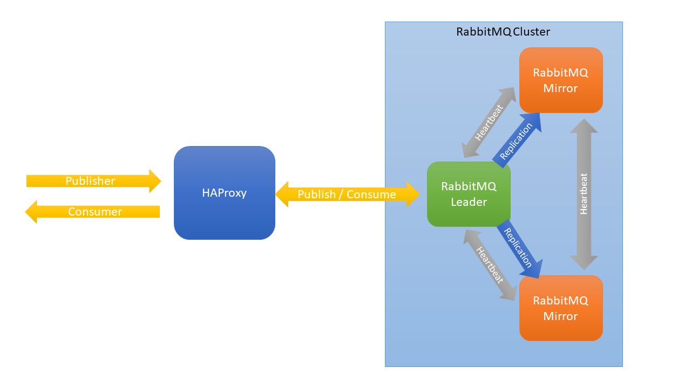

# OSB-RabbitMQ
- [OSB-RabbitMQ](#osb-rabbitmq)
  - [Overview](#overview)
    - [Key Features](#key-features)
    - [Software used by OSB-RabbitMQ](#software-used-by-osb-rabbitmq)
    - [Cluster](#cluster)
  - [Requirements](#requirements)
  - [How to](#how-to)
    - [Create a Service Instance](#create-a-service-instance)
    - [Update a Service Instance](#update-a-service-instance)
    - [Create a Service Binding](#create-a-service-binding)
    - [Acquiring Service Instance Parameters](#acquiring-service-instance-parameters)
    - [Change SSL Certificates](#change-ssl-certificates)
  - [Settings](#settings)
    - [Service Instance Settings Schema](#service-instance-settings-schema)
      - [Server object](#server-object)
      - [SSL object](#ssl-object)
  - [FAQ](#faq)
    - [How a can the cluster  be monitored and managed?](#how-a-can-the-cluster--be-monitored-and-managed)
    - [OSB-RabbitMQ crashed](#osb-rabbitmq-crashed)
    - [A RabbitMQ instance crashed](#a-rabbitmq-instance-crashed)
    - [The size of the backup was bigger than expected (and failed) and now all of my storage space is occupied](#the-size-of-the-backup-was-bigger-than-expected-and-failed-and-now-all-of-my-storage-space-is-occupied)
  - [Appendix](#appendix)
    - [List of supported plugins](#list-of-supported-plugins)

---

## Overview

RabbitMQ is a lightweight message broker that can be deployed in distributed and federated configurations to meet high-scale, high-availability requirements. RabbitMQ lets developers control the routing of the messages by using the messages metadata instead of having the message broker administrator define the routes. RabbitMQ is used worldwide at small startups and large enterprises and tens of thousands of users which makes it one of the most popular open source message brokers.

### Key Features

- **Flexible Routing**: Messages are routed through exchanges before arriving at queues. RabbitMQ features several built-in exchange types (direct, topic, fanout and headers) for typical routing logic. For more complex routing you can [bind exchanges together](https://www.rabbitmq.com/extensions.html#routing) or even write your own exchange type as a plugin.
- **Highly Available Queues**: By mirroring queues across several machines in a cluster, messages are safe even in the event of hardware failure. For more information, see [What is Mirroring?](https://www.rabbitmq.com/ha.html#what-is-mirroring).
- **Multi-protocol**: RabbitMQ supports messaging over a variety of messaging protocols. For more information, see [Which Protocols does RabitMQ support?](https://www.rabbitmq.com/protocols.html).
- **Client Libraries for many Languages**: RabbitMQ has several official client libraries. Libraries exist for, among many other programming languages, Java (and Spring), .NET, Ruby, Python, Javascript (and Node.js) and Go. For a complete list, see [Clients Libraries and Developer Tools](https://www.rabbitmq.com/devtools.html).
- **Management UI**: RabbitMQ has an integrated [management UI](https://www.rabbitmq.com/management.html) which allows for monitoring and controlling of the message broker.
- **Tracing**: RabbitMQ has a [firehose](https://www.rabbitmq.com/firehose.html) feature which makes it able to see every message that is published and every message that is delivered so that, for example, unacked messages can be found. 
- **Plugin System**: RabbitMQ ships with a variety of plugins extending it. Plugins can be selected by sending request parameters within a create/update request sent to the broker (see[Settings](#settings)).

A complete list of features can be found [here](https://www.rabbitmq.com/features.html).

For more information, see the [RabbitMQ Documentation](https://www.rabbitmq.com/documentation.html).

This project is part of our service broker project. For documentation of the service broker see [evoila/osb-docs](https://github.com/evoila/osb-docs).
The OSB-RabbitMQ offers different service plans which vary in allocated memory, cpu, disc-size and number of vms created for RabbitMQ.

### Software used by OSB-RabbitMQ
- **RabbitMQ**: 3.6.12

### Cluster

A RabbitMQ cluster can consist of a single node but it is recommended to have at least 3 nodes if high availability is a concern. The master node is called *leader* and undertakes the task of queueing messages while the other nodes are called *mirrors*, which apply the operations that occur to the leader exactly in the same order as the leader and thus maintain the same state. Requests to a RabbitMQ instance are first sent to a HAProxy instance which then redirects the requests to the leader node.

If a mirror fails, no client needs to take any action or be informed about the failure. The cluster will still work and the mirror node will be restarted when the other nodes do not receive a heartbeat in time (the default time for net ticks is 60 seconds).

If the leader fails, the longest running mirror is promoted to leader. If no mirror is completely synchronized to the leader, messages that only existed on the leader will be lost.

The following image shows, how RabbitMQ nodes are managed:


## Requirements
- [Cloud Foundry CLI](https://docs.cloudfoundry.org/cf-cli/install-go-cli.html)

## How to
### Create a Service Instance

A service instance can be created manually via the CLI-Command
```
cf create-service SERVICE PLAN SERVICE_INSTANCE [-b BROKER] [-c PARAMETERS_AS_JSON] [-t TAGS]
```

- **SERVICE** will be the name of the service broker which is likely going to be **osb-rabbitmq**
- **PLAN** is a plan offered by the service.
- **SERVICE_INSTANCE** the name of the service instance, can be chosen freely.
- **PARAMETERS_AS_JSON** contains additional parameters in JSON-format.

For more information see [Cloud Foundry CLI Reference Guide](https://cli.cloudfoundry.org/en-US/v6/create-service.html).

Aternatively, if there is a dashboard set up (like the Stratos Dashboard for example), it can be used to create a service instance.
> **_IMPORTANT:_** If plugins are selected via dashboard, the default ones (which are required) have to be selected manually.

### Update a Service Instance

A service instance can be updated manually via the CLI-Command
```
cf update-service SERVICE_INSTANCE [-p NEW_PLAN] [-c PARAMETERS_AS_JSON] [-t TAGS] [--upgrade]
```

- **SERVICE_INSTANCE** is be the name of the previously created service instance.
- **PARAMETERS_AS_JSON** contains additional parameters in JSON-format.

For more information see [Cloud Foundry CLI Reference Guide](https://cli.cloudfoundry.org/en-US/v6/update-service.html)

Aternatively, if there is a dashboard set up (like the Stratos Dashboard for example), it can be used to update a service instance.

> **_IMPORTANT:_** Keep in mind that **previous values will be overwritten**. In order to see the existing parameters you can use a dashboard or acquire the parameters via cli (see [Acquiring Service Instance Parameters](#acquiring-service-instance-parameters)).
### Create a Service Binding

A binding can be created manually via the CLI-Command 
```
cf bind-service APP_NAME SERVICE_INSTANCE [--binding-name BINDING_NAME]
```

- **APP_NAME** ist the name of the previously created app that gets the binding injected.
- **SERVICE_INSTANCE** is be the name of the previously created service instance.

For more information see [Cloud Foundry CLI Reference Guide](https://cli.cloudfoundry.org/en-US/v6/bind-service.html).
After creating a binding, the app has to be restarted for the changes to take effect.

Aternatively, if there is a dashboard set up (like the Stratos Dashboard for example), it can be used to create a service binding.

### Acquiring Service Instance Parameters

The current parameters of a service instance can be retrieved via cli:

1. ```cf service --guid **SERVICE_INSTANCE**```
2. ```cf curl v3/service_instances/**SERVICE_INSTANCE_ID**/parameters```
3. A JSON with the parameters will be returned.

- **SERVICE_INSTANCE** is be the name of the previously created service instance.
- **SERVICE_INSTANCE_ID** is the guid of the service instance which is acquired in step 1. 

### Change SSL Certificates

The certificates expire after 365 days. If a certificate is about to expire, contact the operator of the Service Broker to renew the certificates.

If Bosh DNS is used, the certificates are stored in Credhub and can be renewed there. If the root CA is still valid, the certificate can simply be deleted and the new certificate can be used via `bosh manifest`and `bosh deploy`. If the root CA expires, it is necessary to concatenate old and new certificates, for example via [https://github.com/pivotal/credhub-release/blob/main/docs/ca-rotation.md](https://github.com/pivotal/credhub-release/blob/main/docs/ca-rotation.md).</br>
If the IP variant is used and the root CA still valid, it is sufficient to use `bosh recreate`. For changing the root CA, it also has to be concatenated and multiple deploys have to be made.

## Settings

This section covers different settings that can be made for the OSB-RabbitMQ and how they can be changed.
Via the settings, multiple server settings can be changed, for example the plugins used by RabbitMQ and SSL settings.

Settings can be sent as parameters of a create/update request of a service instance via CLI.

The CLI command will look like this:
```
cf cs BROKERNAME PLAN SERVICENAME [-c PARAMETERS_AS_JSON]
```
or
```
cf update-service SERVICE_INSTANCE [-c PARAMETERS_AS_JSON]
```
> **_IMPORTANT:_** Keep in mind that **previous values will be overwritten** when updating. In order to see the existing parameters you can use a dashboard or acquire the parameters via cli (see [Acquiring Service Instance Parameters](#acquiring-service-instance-parameters)).
- **BROKERNAME** will be the name of the service broker which is likely going to be **osb-rabbitmq**
- **PLAN** is the plan that is going to be used for the service instance
- **SERVICENAME** is the name of the service which is up to the user
- **PARAMETERS_AS_JSON** are the settings which are sent in json format

For example, a cli command for creating a service instance could look like this:
```
cf cs osb-rabbitmq s rabbitmq-test -c '{"rabbitmq": {"disk_free_limit": 25000000, "plugins": ["rabbitmq_management", "rabbitmq_delayed_message_exchange"], "ssl": {"enabled": true}}}'
```
An extended example of the parameters for a create/update request for a service instance is shown below:
```json
{
  "rabbitmq": {
    "server": {
      "reverse_dns_lookup": false,
      "disk_alarm_threshold": "{mem_relative,0.4}",
      "disk_free_limit": 50000000,
      "plugins": ["rabbitmq_management", "rabbitmq_delayed_message_exchange"],
      "handshake_timeout": 	10000,
      "net_ticktime": 130,
      "num_ssl_acceptors": 10,
      "frame_max": 131072,
      "channel_max": 2047,
      "cluster_partition_handling": "autoheal",
      "num_tcp_acceptors": 10,
      "fd_limit": 65536,
      "vm_memory_high_watermark": 0.4,
      "ssl": {
        "fail_if_no_peer_cert": false,
        "handshake_timeout": 5000,
        "verify": "verify_none",
        "enabled": true
      }
    }
  }
}
```

In the following section, the fields will be described.

### Service Instance Settings Schema

The following settings are defined in the schema in service_plan.schemas.service_instance.**create**.parameters.properties.rabbitmq.properties and service_plan.schemas.service_instance.**update**.parameters.properties.rabbitmq.properties

> **_IMPORTANT:_** If SSL has been enabled via settings, it must not be disabled, while the service instance ist running.

| Parameter | Type | Default Value | Description |
| - | - | - | - |
| server | [Server](#server-object) object| - | Contains all settings for the RabbitMQ service instance. |


#### Server object

The Server object contains the settings for the RabbitMQ service instance and consists of the following properties:

| Parameter | Type | Default Value | Description |
| - | - | - | - |
| reverse_dns_lookup | boolean | false | Perform reverse DNS lookups when accepting a connection. RabbitMQctl will then display hostnames instead of IP addresses. |
| disk_alarm_threshold | string | {mem_relative,0.4} | The threshold in bytes of free disk space at which rabbitmq will raise an alarm. "{mem_relative}" is relative to the RAM in the machine. Otherwise "absolute" can be used with optional units (e.g. "KB", "MB", "GB") behind an integer number. |
| disk_free_limit | integer | 50000000 | Lower bound for the disk after which a disk alarm will be set. |
| plugins | array of strings | - | Plugins to be used by RabbitMQ. Valid values are listed in [Plugins](#list-of-supported-plugins). **"rabbitmq_management"** is **required**. |
| handshake_timeout | integer | 10000 | Maximum amount of time allowed for the AMQP 0-9-1 and AMQP 1.0 handshake. |
| ssl | [SSL](#ssl-object) object | - | The SSL object contains the configuration for SSL. |
| net_ticktime | integer | 130 | Time until a node is considered lost if no heartbeat is sent. |
| num_ssl_acceptors | integer | 10 | Number of Erlang processes that will accept connections for the TLS. |
| frame_max | integer | 131072 | Set the max permissible size of an AMQP frame (in bytes). |
| channel_max | integer | 2047 | Max permissible number of channels per connection. |
| cluster_partition_handling | string | - | Cluster partition recovery mode. Valid values are "pause_minority" and "autoheal". |
| num_tcp_acceptors | integer | 10 | Number of Erlang processes that will accept connections for the TCP. |
| fd_limit | integer | 65536 | The file descriptor limit for the RabbitMQ process. |
| vm_memory_high_watermark | number | 0.4 | Fraction of the high watermark limit at which queues start to page message out to disc in order to free up memory. |

#### SSL object

| Parameter | Type | Default Value | Description |
| - | - | - | - |
| fail_if_no_peer_cert | boolean | - | Sets, whether RabbitMQ server should reject connection if there is no peer cert. |
| handshake_timeout | integer | 5000 | TLS handshake timeout, in milliseconds. |
| verify | string | verify_none | SSL Peer Verification (use 'verify_peer' or 'verifiy_none' to unable/disable). |
| enabled | boolean | false | Enable SSL/TLS. |

## FAQ

### How a can the cluster  be monitored and managed?

By using the included rabbitmq_management plugin the RabbitMQ nodes can be monitored and managed. The plugin provides a management UI which relies on the [HTTP API](https://www.rabbitmq.com/management.html#http-api) and can be accessed using a Web browser at `http://{node-hostname}:15672/`. The credentials can be found in the service key of the RabbitMQ service instance.

Inside the management UI, the user can add a queue associated with the service key, check the status of a queue associated with the service key, publish messages, read messages and list its consumers.

Administrators are granted full access to the management UI and therefore can, among other capabilities, view node-level data such as memory use and clustering, global statistics for all virtual hosts and the queues of all users. 
For a complete list of capabilties, see [Management Plugin Access and Permissions](https://www.rabbitmq.com/management.html#permissions). **Users are tagged as "policymaker", administrator as "administrator"**.

The admin credentials can be found in Credhub via cli by using the guid of the service instance and are stored in "broker_admin". Afterwards, username and password can be found inside the credentials which can be used to login into the management UI.

### OSB-RabbitMQ crashed

If the service broker crashes, the operator should be contacted.

### A RabbitMQ instance crashed

The following causes can lead to a failure:
- IaaS problems with VMs, network or storage.
- Storage space completely occupied.

Administrators can debug via [Bosh CLI](https://bosh.io/docs/cli-v2/), by viewing the logs found inside the VM:
```
/var/vcap/sys/log/rabbitmq-server
```

If the error **cannot be fixed**, a new instance has to be created.

### The size of the backup was bigger than expected (and failed) and now all of my storage space is occupied

In this case, contact the operator.

## Appendix

### List of supported plugins

- accept
- amqp10_client
- amqp10_common
- amqp_client
- aten
- base64url
- cowboy
- cowlib
- credentials_obfuscation
- cuttlefish
- eetcd
- enough
- gen_batch_server
- getopt
- gun
- jose
- jsx
- observer_cli
- osiris
- prometheus
- quantile_estimator
- ra
- rabbit
- rabbit_common
- rabbitmq_amqp1_0
- rabbitmq_auth_backend_cache
- rabbitmq_auth_backend_http
- rabbitmq_auth_backend_ldap
- rabbitmq_auth_backend_oauth2
- rabbitmq_auth_mechanism_ssl
- rabbitmq_aws
- rabbitmq_consistent_hash_exchange
- rabbitmq_delayed_message_exchange
- rabbitmq_event_exchange
- rabbitmq_federation
- rabbitmq_federation_management
- rabbitmq_jms_topic_exchange
- rabbitmq_management
- rabbitmq_management_agent
- rabbitmq_mqtt
- rabbitmq_peer_discovery_aws
- rabbitmq_peer_discovery_common
- rabbitmq_peer_discovery_consul
- rabbitmq_peer_discovery_etcd
- rabbitmq_peer_discovery_k8s
- rabbitmq_prelaunch
- rabbitmq_prometheus
- rabbitmq_random_exchange
- rabbitmq_recent_history_exchange
- rabbitmq_sharding
- rabbitmq_shovel
- rabbitmq_shovel_management
- rabbitmq_stomp
- rabbitmq_stream
- rabbitmq_stream_common
- rabbitmq_stream_management
- rabbitmq_top
- rabbitmq_tracing
- rabbitmq_trust_store
- rabbitmq_web_dispatch
- rabbitmq_web_mqtt
- rabbitmq_web_mqtt_examples
- rabbitmq_web_stomp
- rabbitmq_web_stomp_examples
- ranch
- seshat
- stdout_formatter
- syslog
- sysmon_handler