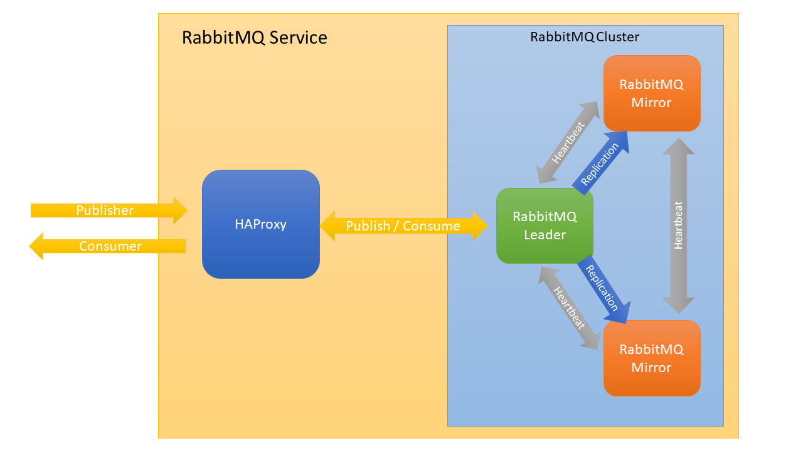

# OSB-RabbitMQ
- [OSB-RabbitMQ](#osb-rabbitmq)
  - [Overview](#overview)
    - [Key Features](#key-features)
    - [Software used by OSB-RabbitMQ](#software-used-by-osb-rabbitmq)
    - [Cluster](#cluster)
  - [TODO Requirements](#todo-requirements)
  - [TODO How to](#todo-how-to)
    - [Create a Service Instance](#create-a-service-instance)
    - [Update a Service Instance](#update-a-service-instance)
    - [Create a Service Binding](#create-a-service-binding)
    - [Acquiring Service Instance Parameters](#acquiring-service-instance-parameters)
    - [Backup](#backup)
    - [Change SSL Certificates](#change-ssl-certificates)
  - [Settings](#settings)
    - [Service Instance Settings Schema](#service-instance-settings-schema)
      - [Server object](#server-object)
      - [SSL object](#ssl-object)
    - [Ingress and egress binding](#ingress-and-egress-binding)
    - [Built-In user credentials](#built-in-user-credentials)
  - [TODO FAQ](#todo-faq)
    - [How a can view the status of the cluster?](#how-a-can-view-the-status-of-the-cluster)
    - [Cluster performance](#cluster-performance)
    - [etc](#etc)
    - [OSB-Elasticsearch crashed](#osb-elasticsearch-crashed)
    - [A Elasticsearch instance crashed (?anwendbar auf elasticsearch?)](#a-elasticsearch-instance-crashed-anwendbar-auf-elasticsearch)
    - [The size of the backup was bigger than expected (and failed) and now all of my storage space is occupied](#the-size-of-the-backup-was-bigger-than-expected-and-failed-and-now-all-of-my-storage-space-is-occupied)
  - [Appendix](#appendix)

---

## Overview

RabbitMQ is a lightweight message broker that can be deployed in distributed and federated configurations to meet high-scale, high-availability requirements. RabbitMQ lets developers control the routing of the messages by using the messages metadata instead of having the message broker administrator define the routes. RabbitMQ is used worldwide at small startups and large enterprises and tens of thousands of users which makes it one of the most popular open source message brokers.

Elasticsearch is a distributed, JSON-based RESTful search and analytics engine. Elasticsearch supports many type of of searches, for example structured, unstructured geo and metric searches and lets you aggregate the search data for easier scaling. It is based on Apache Lucene and makes use of inverted indices which allows a fast processing of full text queries. According to [DB-Engines](https://db-engines.com/en/ranking/search+engine), Elasticsearch is the most popular search engine.

### Key Features

Elasticsearch is a comprehensive software that provides many features. Some of the key features are:

- **Asynchronous messaging**: RabbitMQ supports [multiple messaging protocols](https://www.rabbitmq.com/protocols.html), [message queuing](https://www.rabbitmq.com/tutorials/tutorial-two-python.html), [delivery acknowledgement](https://www.rabbitmq.com/reliability.html), [flexible routing to queues](https://www.rabbitmq.com/tutorials/tutorial-four-python.html) and [multiple exchange types](https://www.rabbitmq.com/tutorials/amqp-concepts.html).
- **Cross-language messaging**: RabbitMQ has several official client libraries such as: Java, .NET, PHP, Python, JavaScript, Ruby, Go and and [many others](https://www.rabbitmq.com/devtools.html).
- **Distributed deployment**: RabbitMQ supports clustering. ??? The OSB-RabbitMQ is formed by using Eureka (?wahrscheinlich was anderes, im Moment Platzhalter).
- **Authentication and authorization**: RabbitMQ provides pluggable [authorization and authentication](https://www.rabbitmq.com/access-control.html) that supports [TLS](https://www.rabbitmq.com/ssl.html) and [LDAP](https://www.rabbitmq.com/ldap.html).
- **Managing and monitoring**: RabbitMQ provides a HTTP-API, command line tool and UI for managing and monitoring. 

A complete list of features can be found [here](https://www.elastic.co/elasticsearch/features).

For more information, see the [Elasticsearch guide](https://www.elastic.co/guide/en/elasticsearch/reference/7.7/index.html).

> **_IMPORTANT:_** The OSB-Elasticsearch sets XMS and XMX (minimum and maximum heap size) of the Java Virtual Machine Options to 46% (änderbar?).

This project is part of our service broker project. For documentation of the service broker see [evoila/osb-docs](https://github.com/evoila/osb-docs).
The OSB-Elasticsearch offers different service plans which vary in allocated memory, cpu, disc-size and number of vms created for Elasticsearch.

### Software used by OSB-RabbitMQ
- **Elasticsearch**: 6.8.0, 7.7.1

??SSL NICHT DEAKTIVIEREN WENN EINMAL ENABLED??
### Cluster

The following image shows, how RabbitMQ nodes are managed:


A RabbitMQ cluster can consist of a single node but it is recommended to have at least 3 nodes if high availability is a concern. The master node is called *leader* and undertakes the task of queueing messages while the other nodes are called *mirrors*, which apply the operations that occur to the leader exactly in the same order as the leader and thus maintain the same state. Requests are sent to a HAProxy instance which redirects the requests to the leader node.

If a mirror fails, no client needs to take any action or be informed about the failure. The cluster will still work and the mirror node will be restarted when the other nodes do not receive a heartbeat in time (the default time for net ticks is 60 seconds).

If the leader fails the longest running mirror is promoted to leader. If no mirror is completely synchronized to the leader, messages that only existed on the leader will be lost.

(?Nutzn wir Mirrored Queue oder Quorum Queue?)

An Elasticsearch cluster can consist of a single node, serving multiple purposes or multiple nodes that can be configured as general nodes or as nodes for specific roles. A general node is responsible for ingesting and filtering requests, processing HTTP requests and storing the data. If not specified, a node will serve as a general node.
If the cluster consists of multiple nodes, they can be assigned specific roles instead of being used for multiple purposes.
The following nodes are supported by the OSB-Elasticsearch which can be defined in the plan of the service catalog:
- **General node**: A node that serves as a multi-purpose-node (functionality of all specific nodes combined). If many resources are needed, splitting a node into multiple nodes with different roles is recommended.
- **Master-eligible node**: A node that serves as master node. A master node is responsible for lightweight cluster-wide actions such as creating or deleting an index, tracking which nodes are part of the cluster, and deciding which shards to allocate to which nodes. In case of a failure of the master node, the remaining master-eligible nodes elect a different master-eligible node as master node. 
- **Coordinating node**: A coordinating node is responsible for receiving client requests, forwarding them to the data nodes that hold the data and combining the data nodes results into a single global resultset. Coordinating nodes have a medium compute, memory and network usage.
- **Data node**: Data nodes hold the shards containing the documents that have been indexed. Data nodes are responsible for handling operations like CRUD, search and aggregations. They have a high storage, memory and compute usage and a medium usage of network resources.
- **Ingest node**: Ingest nodes can execute pre-processing pipelines, composed of one or more ingest processors. For example, an ingest node can be used for filtering a PUT request by the client which it receives from a coordinating node. Ingest nodes have a high compute and a medium memory and network usage.

> **_IMPORTANT:_** The amount of master-eligible nodes together with the general nodes must be odd.


The following image shows the data processing flow of the nodes:


Machine learning nodes are not supported by OSB-Elasticsearch (?wass passiert, wenn man trotzdem ne machine learning node in den plan haut?). Further information about nodes can be found in the [Elasticsearch guide](https://www.elastic.co/guide/en/elasticsearch/reference/7.7/modules-node.html).

## TODO Requirements
- [Cloud Foundry CLI](https://docs.cloudfoundry.org/cf-cli/install-go-cli.html)
- Memory: A node should have at least 4 GB of RAM (recommended minimum is 8 GB) but not greater than 64 GB (see [Heap: Sizing and Swapping](https://www.elastic.co/guide/en/elasticsearch/guide/current/heap-sizing.html))
- Storage: For memory-intense search workloads a ram to storage workload of 1:16..(?TODO)

## TODO How to
### Create a Service Instance

A service instance can be created manually via the CLI-Command
```
cf create-service SERVICE PLAN SERVICE_INSTANCE [-b BROKER] [-c PARAMETERS_AS_JSON] [-t TAGS]
```

- **SERVICE** will be the name of the service broker which is likely going to be **osb-rabbitmq**
- **PLAN** is a plan offered by the service.
- **SERVICE_INSTANCE** the name of the service instance, can be chosen freely.
- **PARAMETERS_AS_JSON** contains additional parameters (?parameters drin lassen? funktioniert NOCH nicht) in JSON-format.

For more information see [Cloud Foundry CLI Reference Guide](https://cli.cloudfoundry.org/en-US/v6/create-service.html)

?Dashboard zeigt Parameter noch nicht?
Aternatively, if there is a dashboard set up (like the Stratos Dashboard for example), it can be used to create a service instance.

### Update a Service Instance

A service instance can be updated manually via the CLI-Command
```
cf update-service SERVICE_INSTANCE [-p NEW_PLAN] [-c PARAMETERS_AS_JSON] [-t TAGS] [--upgrade]
```

- **SERVICE_INSTANCE** is be the name of the previously created service instance.
- **PARAMETERS_AS_JSON** contains additional parameters (?parameters drin lassen? funktioniert NOCH nicht) in JSON-format.

For more information see [Cloud Foundry CLI Reference Guide](https://cli.cloudfoundry.org/en-US/v6/update-service.html)


Aternatively, if there is a dashboard set up (like the Stratos Dashboard for example), it can be used to update a service instance.

> **_IMPORTANT:_** Keep in mind that **previous values will be overwritten**. In order to see the existing parameters you can use a dashboard or acquire the parameters via cli (see [Acquiring Service Instance Parameters](#acquiring-service-instance-parameters)).
### Create a Service Binding

A binding can be created manually via the CLI-Command 
```
cf bind-service APP_NAME SERVICE_INSTANCE [-c PARAMETERS_AS_JSON] [--binding-name BINDING_NAME]
```

- **APP_NAME** ist the name of the previously created app that gets the binding injected.
- **SERVICE_INSTANCE** is be the name of the previously created service instance.
- **PARAMETERS_AS_JSON** contains additional parameters in JSON-format.


For more information see [Cloud Foundry CLI Reference Guide](https://cli.cloudfoundry.org/en-US/v6/bind-service.html).
After creating a binding, the app has to be restarted for the changes to take effect. (??Copy from git repo md)

Aternatively, if there is a dashboard set up (like the Stratos Dashboard for example), it can be used to create a service binding.

### Acquiring Service Instance Parameters

The current parameters of a service instance can be retrieved via cli:

1. ```cf service --guid **SERVICE_INSTANCE**```
2. ```cf curl v3/service_instances/**SERVICE_INSTANCE_ID**/parameters```
3. A JSON with the parameters will be returned.

- **SERVICE_INSTANCE** is be the name of the previously created service instance.
- **SERVICE_INSTANCE_ID** is the guid of the service instance which is acquired in step 1. 


### Backup

TODO 

??Backup

TODO FUTURE FEATURE

Before creating a backup, a backup client must be set up, which can be done by sending [settings](#settings) while creating/updating a service instance.
Afterwards a snapshot can be triggered via the Elasticsearch API:
```
PUT /_snapshot/my_repository/my_snapshot
```
- **my_repository** is the name of the client.
- **my_snapshot** is the name of the snapshot. **Must** be lowercase.
(wird beim erzeugen vom repo compression definiert?)

TODO END FUTURE

Further information about using the Elasticsearch API to create a snapshot can be found [here](https://www.elastic.co/guide/en/elasticsearch/reference/current/create-snapshot-api.html)

It is important to keep in mind that there is enough space for Elasticearch data and backups. The size of the backup corresponds to the size of the indices (?check compression?) which can be checked by sending a request to the Elasticsearch API (see [Index Stats API](https://www.elastic.co/guide/en/elasticsearch/reference/7.7/indices-stats.html)):
```
GET /_stats
```

The size of a plan can be scaled up afterwards but this will copy the disk.

### Change SSL Certificates

The certificates expire after 365 day. If a certificate is about to expire, contact the operator of the Service Broker to renew the certificates.

If Bosh DNS is used, the certificates are stored in Credhub and can be renewed there. If the root CA is still valid, the certificate can simply be deleted and the new certificate can be used via `bosh manifest`and `bosh deploy`. If the root CA expires, it is necessary to concatenate old and new certificates, for example via [https://github.com/pivotal/credhub-release/blob/main/docs/ca-rotation.md](https://github.com/pivotal/credhub-release/blob/main/docs/ca-rotation.md).</br>
If the IP variant is used and the root CA still valid, it is sufficient to use `bosh recreate`. For changing the root CA, it also has to be concatenated and multiple deploys have to be made.

## Settings

This section covers different settings that can be made for the OSB-RabbitMQ and how they can be changed.
Via the settings, multiple server settings can be changed, for example the plugins used by RabbitMQ and SSL settings.

Settings can be sent as parameters of a create/update request of a service instance via CLI.

The CLI command will look like this:
```
cf cs BROKERNAME PLAN SERVICENAME [-c PARAMETERS_AS_JSON]
```
or
```
cf update-service SERVICE_INSTANCE [-c PARAMETERS_AS_JSON]
```
> **_IMPORTANT:_** Keep in mind that **previous values will be overwritten**. In order to see the existing parameters you can use a dashboard or acquire the parameters via cli (see [Acquiring Service Instance Parameters](#acquiring-service-instance-parameters)).
- **BROKERNAME** will be the name of the service broker which is likely going to be **osb-rabbitmq**
- **PLAN** is the plan that is going to be used for the service instance
- **SERVICENAME** is the name of the service which is up to the user
- **PARAMETERS_AS_JSON** are the settings which are sent in json format

For example, a cli command for creating a service instance could look like this:
```
cf cs osb-elasticsearch s elasticsearch-test -c '{"elasticsearch":{"backup":{"s3":{"clients": [{"name":"clientname", "access_key":"XXXXXX", "secret_key":"XXXXXX}]}}}}'
```
An extended example of the parameters for a create/update request for a service instance is shown below:
```json
{
    "elasticsearch": {
        "ssl": {
            "certificate_authorities": "example?"
        },
        "backup": {
          "s3": {
            "clients": [
              {
                "name": "first-client",
                "access_key": "XXXXXX",
                "secret_key": "XXXXXX",
                "endpoint": "https://example.com",
                "read_timeout": "5s",
                "max_retries": 3,
                "use_throttle_retries": true
              },
              {
                "name": "amazon",
                "access_key": "XXXXXX",
                "secret_key": "XXXXXX"
              }
            ]
          }
        }
    }
}
```

In the following section, the fields will be described.

### Service Instance Settings Schema

The following settings are defined in the schema in service_plan.schemas.service_instance.**create**.parameters.properties.rabbitmq.properties and service_plan.schemas.service_instance.**update**.parameters.properties.rabbitmq.properties (?überprüfen ob korrekt)

| Parameter | Type | Default Value | Description |
| - | - | - | - |
| server | | | |


#### Server object

The SSL object contains the trusted certificate authorities and consists of the following properties:

| Parameter | Type | Default Value | Description |
| - | - | - | - |
| reverse_dns_lookup | boolean | false | Perform reverse DNS lookups when accepting a connection. RabbitMQctl will then display hostnames instead of IP addresses. |
| disk_alarm_threshold | string | {mem_relative,0.4} | The threshold in bytes of free disk space at which rabbitmq will raise an alarm. "mem_relative" is relative to the RAM in the machine. Otherwise "absolute" can be used with optional units (e.g. "KB", "MB", "GB") behind an integer number. |
| disk_free_limit | integer | 50000000 | Lower bound for the disk after which a disk alarm will be set |
| plugins | array of strings | - | Plugins to be used by RabbitMQ. Valid values are "rabbitmq_management", "rabbitmq_mqtt", "rabbitmq_stomp", "rabbitmq_auth_mechanism_ssl", "rabbitmq_delayed_message_exchange". **"rabbitmq_management"** and **"rabbitmq_delayed_message_exchange"** are **required** |
| handshake_timeout | integer | 10000 | Maximum amount of time allowed for the AMQP 0-9-1 and AMQP 1.0 handshake. |
| ssl | [SSL](#ssl-object) object | - | The SSL object contains the configuration for SSL |
| net_ticktime | integer | 130 | Time until a node is considered lost if no heartbeat is sent. |
| num_ssl_acceptors | integer | 10 | Number of Erlang processes that will accept connections for the TLS. |
| frame_max | integer | 131072 | Set the max permissible size of an AMQP frame (in bytes). |
| channel_max | integer | integer | 2047 | Max permissible number of channels per connection. |
| cluster_partition_handling | string | - | Cluster partition recovery mode. Valid values are "pause_minority" and "autoheal". |
| num_tcp_acceptors | integer | 10 | Number of Erlang processes that will accept connections for the TCP. |
| fd_limit | integer | 65536 | The file descriptor limit for the RabbitMQ process. |
| vm_memory_high_watermark | number | 0.4 | Fraction of the high watermark limit at which queues start to page message out to disc in order to free up memory. |

#### SSL object

| Parameter | Type | Default Value | Description |
| - | - | - | - |
| fail_if_no_peer_cert | boolean | - | Sets, whether RabbitMQ server should reject connection if there is no peer cert. |
| handshake_timeout | integer | 5000 | TLS handshake timeout, in milliseconds. |
| verify | string | verify_none | SSL Peer Verification (use 'verify_peer' or 'verifiy_none' to unable/disable) |
| enabled | boolean | false | Enable SSL/TLS |

### Ingress and egress binding

When you create a new service binding in cloudfoundry, you can provide an client mode, either ingress or egress. The broker automatically filters the nodes and returns only the IPs corresponding to the client mode passed. If you do not specify a client mode, egress will be used.

Example:

`cf bind-service APP_NAME SERVICE_INSTANCE -c '{"clientMode":"ingress"}'`

`cf bind-service APP_NAME SERVICE_INSTANCE -c '{"clientMode":"egress"}'`

### Built-In user credentials

An Elasticsearch installation includes a small number of built-in users for example to have access to Kibana. In order to obtain these special access data, a new binding must be created and the corresponding client mode must be specified.

To obtain **Admin** credentials use `cf bind-service APP_NAME SERVICE_INSTANCE -c '{"clientMode":"superuser"}'`

To obtain **Kibana** credentials use `cf bind-service APP_NAME SERVICE_INSTANCE -c '{"clientMode":"kibana"}'`

To obtain **Logstash** credentials use `cf bind-service APP_NAME SERVICE_INSTANCE -c '{"clientMode":"logstash"}'`

## TODO FAQ

### How a can view the status of the cluster?
Generelle Cluster Infos um Rückschlüsse ziehen zu können
### Cluster performance

### etc

### OSB-Elasticsearch crashed

If the service broker crashes, the operator should be contacted.

### A Elasticsearch instance crashed (?anwendbar auf elasticsearch?)

As long as the majority of MongoDB instances is running after another instance failed, the database is still functional. The Bosh director will detect the failure and try to repair the broken instance. If an automatic repair of the instance is not possible, it has to be fixed manually.

The following causes can lead to a failure:
- IaaS problems with VMs, network or storage.
- Storage space completely occupied.

Access to the VM via [Bosh CLI](https://bosh.io/docs/cli-v2/) is required for debugging. First, the following two files have to be sourced within the VM.

```
/var/vcap/jobs/mongodb/env
/var/vcap/jobs/mongodb/bin/post-deploy
```
Start the Mongo cli ($MONGO) as admin (password can be found in **post-deploy** or CredHub for example) --authenticationDatabase admin --host $MONGODB_HOST.

For example:
```
$MONGO -u admin -p ADMIN_PASSWORD --authenticationDatabase admin --host $MONGODB_HOST
```
Afterwards the state of the cluster can be retrieved with the command `rs.status()`. 
Additional information can be retrieved with the command `rs.isMaster()`.

**Majority** of nodes (including primary) failed and can't be reinitialized:</br>
In this case no secondary can be elected as primary. The only options are reinitializing the replica set or [reconfiguring](https://docs.mongodb.com/manual/tutorial/reconfigure-replica-set-with-unavailable-members/) it.

In many cases it is also possible, to retrieve the oplog of a failed primary with [`mongodump`](https://docs.mongodb.com/database-tools/mongodump/) using the `--oplog` flag and recover the database by replaying the oplog with [`mongorestore`](https://docs.mongodb.com/database-tools/mongorestore/) using the `--oplogReplay` flag.
Currently, replaying an oplog is not supported by the Backup Manager. Changes to the database while doing a backup **may not** be recorded.

The following logs are relevant for troubleshooting:

```
/var/vcap/sys/log/mongodb/server.stderr.log
/var/vcap/sys/log/mongodb/server.stdout.log
```

While performing maintenance on single replica set members, each node has to be restarted as standalone. Afterwards, maintenance can be done on the node and then be restarted as a member of the replica set. The primary should come last. More information about maintaining replica set members can be found [here](https://docs.mongodb.com/manual/tutorial/perform-maintence-on-replica-set-members/).

If the error **cannot be fixed**, a new instance has to be created and restored by using a backup.

### The size of the backup was bigger than expected (and failed) and now all of my storage space is occupied

In this case, contact the operator.

## Appendix

(?nur schema? schema hier? kompletter catalog in assets? -> weitere anpassungen im catalog außer persisten disk und vm type?)