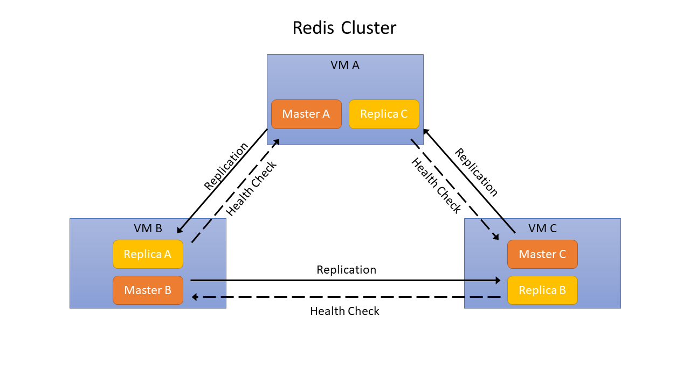

# OSB-Redis
- [OSB-Redis](#osb-redis)
  - [Overview](#overview)
    - [Key Features](#key-features)
    - [Software used by OSB-Redis](#software-used-by-osb-redis)
    - [Cluster](#cluster)
  - [Requirements](#requirements)
  - [How to](#how-to)
    - [Create a Service Instance](#create-a-service-instance)
    - [Update a Service Instance](#update-a-service-instance)
    - [Create a Service Binding](#create-a-service-binding)
    - [Acquiring Service Instance Parameters](#acquiring-service-instance-parameters)
  - [Settings](#settings)
    - [Service Instance Settings Schema](#service-instance-settings-schema)
      - [Config object](#config-object)
      - [Limits object](#limits-object)
      - [Store object](#store-object)
  - [FAQ](#faq)
    - [OSB-Redis crashed](#osb-redis-crashed)
    - [A Redis master/replica node crashed](#a-redis-masterreplica-node-crashed)
    - [The size of the backup was bigger than expected (and failed) and now all of my storage space is occupied](#the-size-of-the-backup-was-bigger-than-expected-and-failed-and-now-all-of-my-storage-space-is-occupied)
  - [Appendix](#appendix)
    - [JSON-Schema](#json-schema)

---

## Overview

[Redis](https://redis.io/) is an open-source, in-memory data structure store that can be used as database, cache and message broker. By storing data in-memory, operations are executed at high speed

### Key Features

Redis offers many useful features, including:
- **Data structures**: Redis provides data structures such as strings, hashes, lists, sets, sorted sets with range queries, bitmaps, hyperloglogs and [geospatial indexes](https://redis.io/commands/geoadd). An introduction of the data types can be found [here](https://redis.io/topics/data-types-intro).
- **Replication**: Redis offers a simple to use and configure leader follower (master-replica) replication where followers (replicas) are copies of the leader (master). The replication can be used for scalability, in order to have multiple replicas for read-only queries, or simply for improving data safety and high availability. More information can be found in the section [Cluster](#cluster) and on [Redis Replication](https://redis.io/topics/replication).
- **High availability**: In case a master node fails, a replica of it will be elected as new master.
- **Automatic sharding of data across nodes**: By using Redis Cluster, the dataset can be split among multiple nodes and Redis can still continue its operations when a subset of of the nodes is experiencing failures.
- **Lua scripting**: Redis supports Lua scripts so that the database can be extended easily.
- **Clients for different languages**: Redis has a large selection of clients in many programming languages, for example C, C#, C++, Go, Java, Node.js, Python and Ruby. For complete list, see [Redis Clients](https://redis.io/clients).

The OSB-Redis offers different service plans which vary in allocated memory, cpu, disc-size and number of vms created for PostgreSQL.

### Software used by OSB-Redis
- **Redis**: 4.0.11

### Cluster

The service instances use Redis Cluster. This allows to automatically split a dataset among multiple nodes and to continue operations when a subset of the nodes are experiencing failures or are unable to communicate with the rest of the cluster.

Redis Cluster does not use consistent caching, but a different form of sharding where every key is part of a so called *hash slot*. A Redis cluster consists of 16384 hash slots. If multiple VMs are created, a Redis master node is started on each. Each Redis master node is responsible for a subset of the hash slots. Additionaly, each master node has a replica node, which runs on a different VM so that in case of a failure of a VM, another VM has the replica of the master which can be promoted as new master node. 

Example: The cluster consists of 3 VMs. VM(A) runs master node A and replica node c', VM(B) runs master node B and replica node a' and VM(C) runs master node C and replica node b'. If VM(A) fails, the replica node a' in VM(B) will be promoted as new master noder. VM(B) now runs master nodes A and B.

The following image shows how replication and health checks are performed within a redis cluster:


For more information, see the [Redis Cluster tutorial](https://redis.io/topics/cluster-tutorial).

## Requirements
- [Cloud Foundry CLI](https://docs.cloudfoundry.org/cf-cli/install-go-cli.html)

## How to
### Create a Service Instance

A service instance can be created manually via the CLI-Command
```
cf create-service SERVICE PLAN SERVICE_INSTANCE [-b BROKER] [-c PARAMETERS_AS_JSON] [-t TAGS]
```

- **SERVICE** will be the name of the service broker which is likely going to be **osb-redis**.
- **PLAN** is a plan offered by the service.
- **SERVICE_INSTANCE** the name of the service instance, can be chosen freely.
- **PARAMETERS_AS_JSON** contains the settings shown in [Settings](#settings).

For more information see [Cloud Foundry CLI Reference Guide](https://cli.cloudfoundry.org/en-US/v6/create-service.html).

Aternatively, if there is a dashboard set up (like the Stratos Dashboard for example), it can be used to create a service instance.

### Update a Service Instance

A service instance (and therefore its settings) can be updated manually via the CLI-Command
```
cf update-service SERVICE_INSTANCE [-p NEW_PLAN] [-c PARAMETERS_AS_JSON] [-t TAGS] [--upgrade]
```

- **SERVICE_INSTANCE** is be the name of the previously created service instance.
- **PARAMETERS_AS_JSON** contains the settings shown in [Settings](#settings)

For more information see [Cloud Foundry CLI Reference Guide](https://cli.cloudfoundry.org/en-US/v6/update-service.html).

Aternatively, if there is a dashboard set up (like the Stratos Dashboard for example), it can be used to update a service instance.

Keep in mind that **previous values will be overwritten**. In order to see the existing parameters you can use a dashboard or acquire the parameters via cli (see [Acquiring Service Instance Parameters](#acquiring-service-instance-parameters)).

### Create a Service Binding

A binding can be created manually via the CLI-Command 
```
cf bind-service APP_NAME SERVICE_INSTANCE [-c PARAMETERS_AS_JSON] [--binding-name BINDING_NAME]
```

- **APP_NAME** ist the name of the previously created app that gets the binding injected.
- **SERVICE_INSTANCE** is be the name of the previously created service instance.

For more information see [Cloud Foundry CLI Reference Guide](https://cli.cloudfoundry.org/en-US/v6/bind-service.html).
After creating a binding, the app has to be restarted for the changes to take effect.

Aternatively, if there is a dashboard set up (like the Stratos Dashboard for example), it can be used to create a service binding.

### Acquiring Service Instance Parameters

The current parameters (and therefore settings) can be retrieved via cli:

1. ```cf service --guid **SERVICE_INSTANCE**```
2. ```cf curl v3/service_instances/**SERVICE_INSTANCE_ID**/parameters```
3. A JSON with the parameters will be returned.

- **SERVICE_INSTANCE** is be the name of the previously created service instance.
- **SERVICE_INSTANCE_ID** is the guid of the service instance which is acquired in step 1. 

## Settings
This section covers different settings that can be made for the OSB-Redis, their default values and how they can be changed.

Settings can be sent as parameters of a create/update request of a service instance via CLI.

TThe CLI command will look like this:
```
cf cs SERVIE PLAN SERVICE_INSTANCE_ [-c PARAMETERS_AS_JSON]
```
or
```
cf update-service SERVICE_INSTANCE [-c PARAMETERS_AS_JSON]
```
- **SERVICE** will be the name of the service broker which is likely going to be **osb-redis**.
- **PLAN** is the plan that is going to be used for the service instance.
- **SERVICE_INSTANCE** is the name of the service instance.
- **PARAMETERS_AS_JSON** are the settings which are sent in json format.

For example, a cli command for creating a service instance could look like this:
```
cf cs osb-redis s redis-test -c '{"redis":{"config":{"tcp_keepalive":70}, "store":{"rdbcompression":"no"}}}'
```
An extended example of the parameters for a create/update request for a service instance is shown below:
```json
{
    "redis": {
      "config": {
        "tcp_keepalive": 42,
        "timeout": 65
      },
      "limits": {
        "fd": 65000
      },
      "store": {
        "rdbchecksum": "yes",
        "rdbcompression": "no",
        "stop_writes_on_bgsave_error": "yes"
      }
    }
}
```

### Service Instance Settings Schema

The following settings are defined in the schema in service_plan.schemas.service_instance.**create**.parameters.properties.redis.properties and service_plan.schemas.service_instance.**update**.parameters.properties.redis.properties.

| Parameter | Type | Default Value | Description |
| - | - | - | - |
| config | Config object  | - | Contains connection settings. |
| limits | Limits object | - | Contains IO settings. |
| store | Store object | - | Contains database exensions |

#### Config object

The Config object contains the connection settings.

| Parameter | Type | Default Value | Description |
| - | - | - | - |
| tcp_keepalive | number  | - | TCP keepalive time in seconds. This parameter is **required**. |
| timeout | number | - | Connection timeout after idle in seconds. This parameter is **required**. |

#### Limits object

The Limits object contains IO settings.

| Parameter | Type | Default Value | Description |
| - | - | - | - |
| fd | number | - | Maximum number of file descriptors (e.g. 65536). This parameter is **required** |

#### Store object

| Parameter | Type | Default Value | Description |
| - | - | - | - |
| rdbchecksum | string | - | RDB files created with checksum disabled. Valid values are "yes" and "no". This parameter is **required**. |
| rdbcompression | string | - | Compress string objects using LZF. Valid values are "yes" and "no". This parameter is **required**. |
| stop_writes_on_bgsave_error| string | - | Determines, whether writes should be stopped if a bgsvae_error occurs. |

> **_IMPORTANT:_** The default value is used if the service instance is created/updated via gui, otherwise the values have to be set manually.


## FAQ

### OSB-Redis crashed

If the service broker crashes, the operator should be contacted.

### A Redis master/replica node crashed

As long as there is a replica node or its master node running after the other node failed, Redis is still functional.

The following causes can lead to a failure:
- IaaS problems with VMs, network or storage
- Storage space completely occupied

Access to the VM via [Bosh CLI](https://bosh.io/docs/cli-v2/) is required for debugging. The logs of Redis master and replica nodes can be acquired within the VM under:

```
/var/vcap/sys/log/redis/
```
Additionally, the Redis CLI can be found under 
```
/var/vcap/packages/redis/bin
```
And the password in
```
/var/vcap/jobs/redis/bin/ctl
```
or in Credhub.

If the error **cannot be fixed**, a new instance has to be created and restored by using a backup.

### The size of the backup was bigger than expected (and failed) and now all of my storage space is occupied

In this case, contact the operator.

## Appendix

### JSON-Schema

```
schemas: &schemas
        service_instance:
          create: &createUpdate
            parameters:
              properties:
                redis:
                  properties:
                    config:
                      properties:
                        tcp_keepalive:
                          defaultValue: 60
                          title: TCP Keepalive
                          type: number
                        timeout:
                          defaultValue: 60
                          title: Connection Timeout after Idle
                          type: number
                      required:
                      - timeout
                      - tcp_keepalive
                      title: Connections Settings
                      type: object
                    limits:
                      properties:
                        fd:
                          defaultValue: 65536
                          title: Maximum number of file descriptors
                          type: number
                      required:
                      - fd
                      title: IO Settings
                      type: object
                    store:
                      properties:
                        rdbchecksum:
                          defaultValue: true
                          enums:
                          - "yes"
                          - "no"
                          title: RDB files created with checksum disabled
                          type: string
                        rdbcompression:
                          defaultValue: true
                          enums:
                          - "yes"
                          - "no"
                          title: Compress string objects using LZF
                          type: string
                        stop_writes_on_bgsave_error:
                          defaultValue: true
                          enums:
                          - "yes"
                          - "no"
                          title: Stop accepting writes
                          type: string
                      required:
                      - stop_writes_on_bgsave_error
                      - rdbcompression
                      - rdbchecksum
                      title: RDB Settings
                      type: object
                  title: Redis Configuration
                  type: object
              schema: http://json-schema.org/draft-06/schema
              type: object
          update: *createUpdate
```